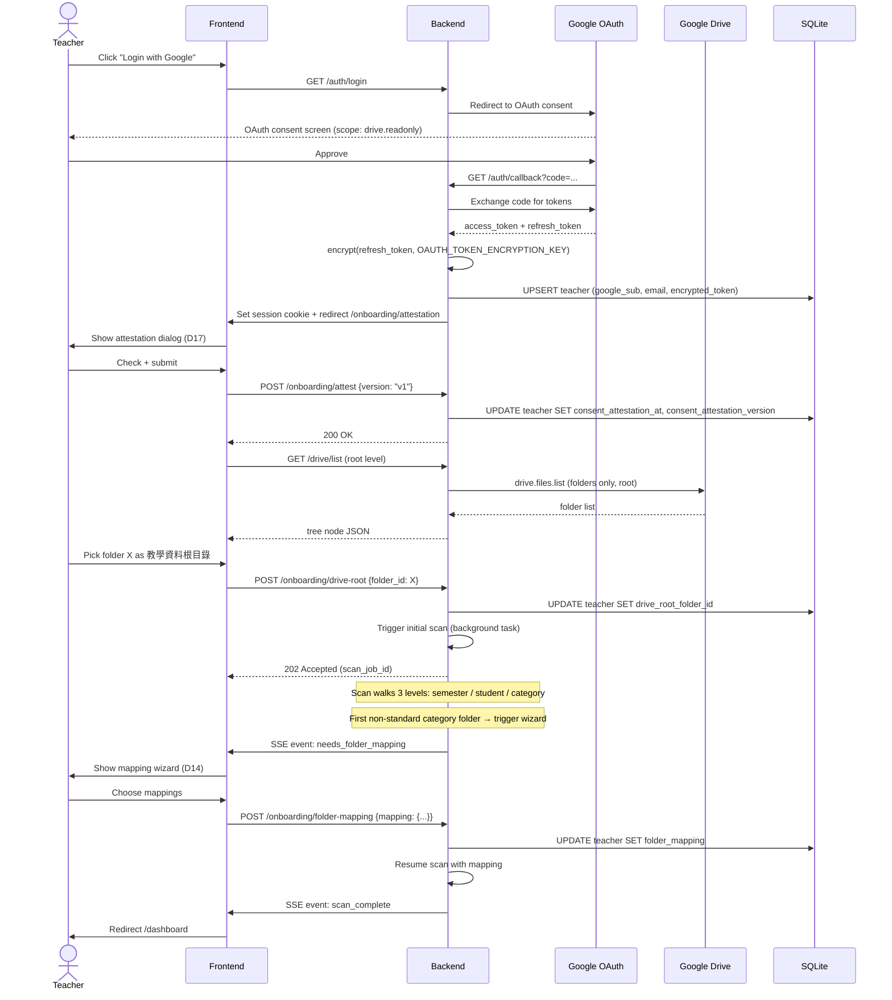
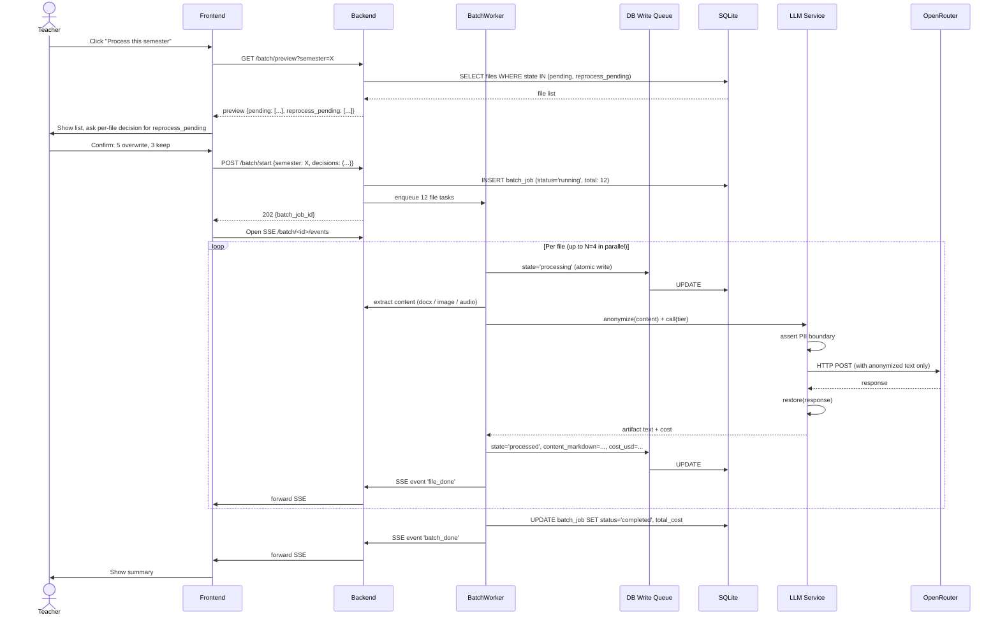
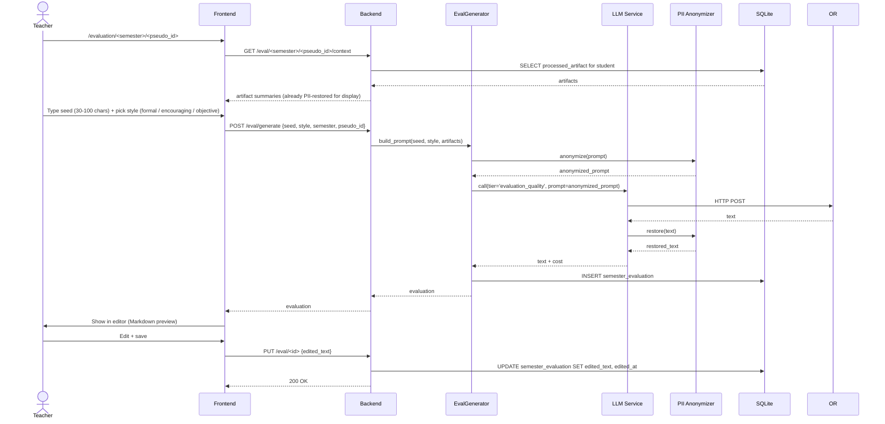
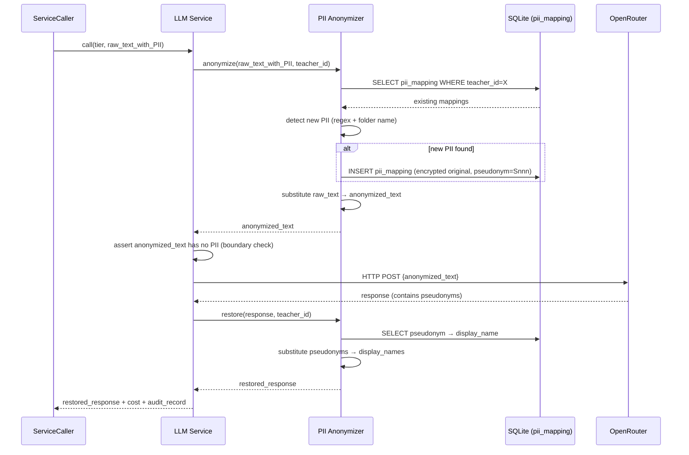
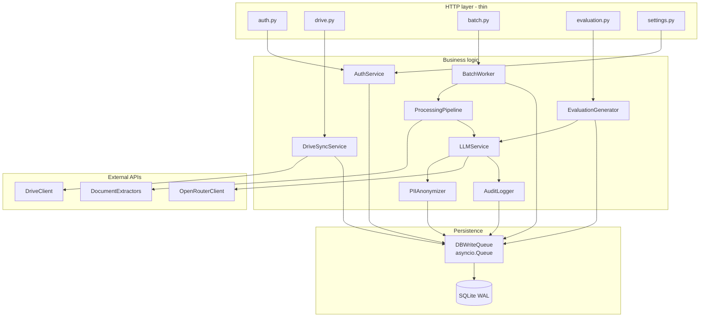
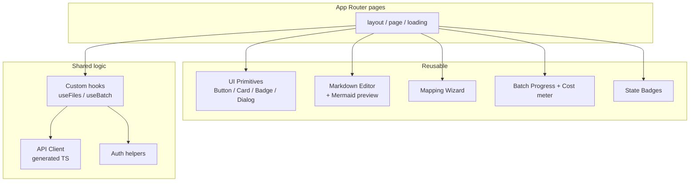
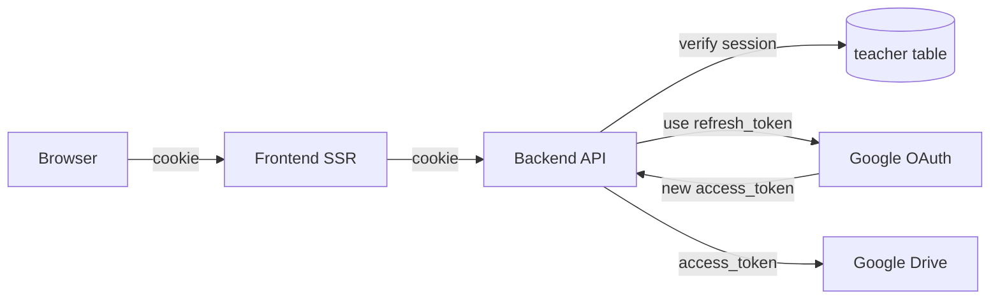

# ARCH-001: System Architecture

| Field | Value |
|-------|-------|
| **Status** | Draft v0.1 |
| **Date** | 2026-05-10 |
| **Owner** | Steven Chen |
| **Depends on** | [`PRD.md`](PRD.md) v0.2, [`adr/ADR-001-system-foundation.md`](adr/ADR-001-system-foundation.md) |
| **Consumers** | DESIGN-001, UIUX-001, BDD-001, TDD-001 |

---

## 0. Document Control

| Version | Date | Author | Change |
|---------|------|--------|--------|
| 0.1 | 2026-05-10 | Steven (with Claude Code) | Initial — module structure, data flow, deployment topology |

**Reading order**:
- §2 Module Structure → §3 Data Flow → §4 Component Architecture (these are mutually reinforcing)
- §5 Deployment / §6 Cross-cutting / §7 Performance / §8 Security (independent, read as needed)
- §9 Open Architectural Questions punt to DESIGN-001

---

## 1. Context

This document expands on PRD §8 (high-level architecture diagram) and ADR-001 (architectural axes). It freezes:
- **Module names** that all subsequent design docs reference
- **Data flow paths** through the system
- **Deployment topology** for V1

It is **not** a detailed module API spec — that's DESIGN-001's job. Where this doc says "the LLM Service does X", DESIGN-001 will say "`class LLMService` exposes async method Y with signature Z".

**Binding decisions from ADR-001**:
- Single-tenant single-user (Axis 1)
- Python (FastAPI) backend + Next.js (React) frontend (Axis 2)
- PII anonymization at LLM Service boundary (Axis 3)
- Batch processing with persistent state machine (Axis 4)
- Tier-based LLM routing (Axis 5)
- SQLite + WAL + write serialization queue (Axis 6)
- Docker container, multi-target deploy (Axis 7)

---

## 2. Module Structure

### 2.1 Backend module tree (FastAPI)

```
backend/
├── pyproject.toml                # uv / pip-tools managed
├── alembic.ini
├── alembic/                      # DB migrations
│   └── versions/
├── app/
│   ├── main.py                   # FastAPI app + lifespan
│   ├── config.py                 # Pydantic Settings (env vars)
│   ├── routers/                  # HTTP endpoint layer (thin)
│   │   ├── auth.py               # OAuth callback, logout, revoke
│   │   ├── drive.py              # /drive/list, /drive/select-root
│   │   ├── files.py              # /file/<id>, /file/<id>/download
│   │   ├── batch.py              # /batch/start, /batch/status, /batch/cancel
│   │   ├── evaluation.py         # /eval/generate, /eval/<id>
│   │   ├── settings.py           # /settings/* (LLM tier, PII, folder mapping)
│   │   └── system.py             # /healthz, /readyz
│   ├── services/                 # Business logic (where the work happens)
│   │   ├── auth_service.py
│   │   ├── drive_sync_service.py
│   │   ├── pii_anonymizer.py     # ONE chokepoint for all PII
│   │   ├── llm_service.py        # ONE chokepoint for all OpenRouter calls
│   │   ├── processing_pipeline.py  # File → markdown / transcript
│   │   ├── batch_worker.py       # Async task pool + state machine
│   │   ├── evaluation_generator.py
│   │   ├── audit_logger.py
│   │   └── encryption.py         # AES-256 helpers (PII + OAuth tokens)
│   ├── adapters/                 # External-API gateways
│   │   ├── drive_client.py       # Wraps google-api-python-client
│   │   ├── openrouter_client.py  # Wraps openai SDK pointing at OpenRouter
│   │   └── document_extractors/  # python-docx, openpyxl, pypdf, etc.
│   │       ├── docx.py
│   │       ├── xlsx.py
│   │       ├── pptx.py
│   │       └── pdf.py
│   ├── models/                   # SQLAlchemy ORM models
│   │   ├── teacher.py
│   │   ├── drive_file.py
│   │   ├── processed_artifact.py
│   │   ├── pii_mapping.py
│   │   ├── semester_evaluation.py
│   │   ├── batch_job.py
│   │   └── llm_call_audit.py
│   ├── schemas/                  # Pydantic request/response DTOs
│   │   └── ... (mirror routers)
│   ├── db/
│   │   ├── session.py            # aiosqlite engine + session
│   │   └── write_queue.py        # asyncio.Queue serializer
│   └── core/
│       ├── exceptions.py         # Custom exception hierarchy
│       └── lifespan.py           # Startup: WAL checkpoint, stale-recovery
└── tests/
    ├── unit/
    ├── integration/
    └── e2e/                      # Backend-driven E2E (pre-Playwright)
```

**Layer rules** (enforced by code review and `import-linter`):
- `routers` may import `services`, `schemas`, `core` — never `models` directly, never `adapters`
- `services` may import `adapters`, `models`, `core`
- `adapters` may import only `core` and external libs
- `models` are pure SQLAlchemy — no business logic
- `schemas` are pure Pydantic — no business logic

### 2.2 Frontend module tree (Next.js App Router)

```
frontend/
├── package.json                  # pnpm preferred (smaller lockfile)
├── tsconfig.json
├── next.config.mjs
├── public/
├── src/
│   ├── app/                      # Next.js App Router
│   │   ├── layout.tsx
│   │   ├── page.tsx              # / (dashboard)
│   │   ├── login/page.tsx        # /login
│   │   ├── onboarding/
│   │   │   ├── attestation/page.tsx     # /onboarding/attestation
│   │   │   ├── drive-root/page.tsx      # /onboarding/drive-root
│   │   │   └── folder-mapping/page.tsx  # /onboarding/folder-mapping
│   │   ├── semester/[label]/page.tsx
│   │   ├── student/[pseudo_id]/page.tsx
│   │   ├── file/[drive_file_id]/page.tsx
│   │   ├── evaluation/[semester]/[pseudo_id]/page.tsx
│   │   └── settings/
│   │       ├── llm/page.tsx
│   │       ├── pii/page.tsx
│   │       ├── folder-mapping/page.tsx
│   │       ├── budget/page.tsx
│   │       └── account/page.tsx
│   ├── components/               # Reusable presentational
│   │   ├── ui/                   # Primitives (Button, Card, Badge, Dialog…)
│   │   ├── editor/               # Markdown editor + Mermaid preview
│   │   ├── badges/               # State badges (pending / processing / …)
│   │   ├── wizard/               # Mapping wizard (D14)
│   │   └── progress/             # Batch progress bar + cost meter
│   ├── lib/
│   │   ├── api/                  # Generated TS client from FastAPI OpenAPI
│   │   │   └── client.ts
│   │   ├── auth/                 # Cookie / session helpers
│   │   ├── hooks/                # React hooks (useFiles, useBatch, …)
│   │   └── utils/
│   ├── styles/
│   │   ├── globals.css
│   │   └── tokens.css            # Design tokens (extracted from mockups)
│   └── types/
│       └── api.ts                # Generated from OpenAPI; do not edit by hand
└── tests/
    ├── unit/                     # vitest + @testing-library/react
    └── e2e/                      # Playwright specs
```

**Frontend conventions**:
- Server-side API calls go through `lib/api/client.ts` (generated, type-safe)
- All UI state names are **provider-agnostic** (e.g., `llmQuotaPaused`, NOT `geminiQuotaPaused`) — see lessons-learned `frontend.md`
- Async-set state required for `:disabled` / `x-show` equivalents must be `await`-ed before render — see lessons-learned `frontend.md`
- SSE / WebSocket connections deferred until after `useEffect` settles to avoid Chrome tab spinner issue (lessons-learned `frontend.md`)

### 2.3 Shared types

OpenAPI is the single source of truth:

```
backend (FastAPI native /openapi.json)
    ↓ openapi-typescript codegen
frontend/src/types/api.ts (read-only)
```

Build pipeline regenerates `api.ts` on backend schema change. CI fails if `api.ts` is out of date relative to backend.

---

## 3. Data Flow

### 3.1 Onboarding flow (OAuth → Attestation → Drive root → Folder mapping)



**Key observations**:
- OAuth callback is the **only** server endpoint that touches Google Auth — wrapped in `auth_service.py`
- Mapping wizard interrupts scan **mid-flow**; scan resume requires the mapping to be persisted before continuing
- Scan progress communicated via SSE (Server-Sent Events) — frontend defers connection per `frontend.md` lesson

### 3.2 Batch processing flow (with edit-conflict prompts)



**Key observations**:
- `BatchWorker` runs as **asyncio task pool** with concurrency N (default 4, configurable)
- All DB writes funnel through `DBWriteQueue` (single-writer serialization for SQLite WAL — see §6.5)
- LLM Service is the **chokepoint** that enforces PII anonymization (Axis 3 ADR)
- SSE updates are forwarded via the API process (worker and API share process — Axis 4)
- Failure paths (omitted from diagram for clarity): `state='failed'` with `failure_reason`; retried up to 3x with exponential backoff before terminal

### 3.3 Evaluation generation flow



**Key observations**:
- The **prompt builder** (in `evaluation_generator.py`) selects which artifacts to include — token budget management lives here, not in LLM Service
- PII anonymizer runs both **pre-call** (on prompt) and **post-call** (on response) — symmetric round-trip
- Editing the LLM-generated text is a different DB column (`edited_text`) from the original (`generated_text`) — preserves audit trail per ADR-001 Axis 3 implications

### 3.4 PII anonymize / restore cycle



**Boundary assertion** is the load-bearing safety check. Before HTTP POST, LLM Service runs the `anonymized_text` against a known-PII regex (e.g., Taiwan phone numbers, common name patterns); any positive match raises `PIILeakageError` and aborts the call. This catches anonymizer bugs before data leaves the system.

---

## 4. Component Architecture

### 4.1 Backend component diagram (refines PRD §8)



**Key invariants**:
- **All `*_R` Routers are thin** — they handle auth, request validation (Pydantic), call one service, return DTO
- **All DB writes go through `WriteQ`** — services NEVER call DB session directly for writes (reads OK)
- **`LLMSvc` is the only path to `ORAd`** — services that need LLM go through `LLMSvc`, never direct
- **`PII` precedes `ORAd`** — enforced inside `LLMSvc`

### 4.2 Frontend component layers



### 4.3 External dependencies map

| External | Role | Failure mode | V1 fallback |
|----------|------|--------------|-------------|
| Google OAuth | Authentication | Token expiry / revocation | UI redirects to re-OAuth |
| Google Drive | Source data | Rate limit (429) / permission revoke (403) | Backoff with `Retry-After`; pause batch on 403 |
| OpenRouter | LLM gateway | Rate limit (429) / model deprecated / timeout | Retry up to 3x; fall through to `failed` state |
| SQLite | Local persistence | DB locked (concurrent write) | Retry 3x with backoff (10/100/1000ms) |
| Local FS (audio cache) | Transient | Disk full | Pre-check available space before download; fail batch with clear error |

---

## 5. Deployment Topology

### 5.1 Docker Compose (default — local & VPS)

```yaml
# docker-compose.yml
services:
  app:
    image: teacher-comments:latest
    build: .
    ports:
      - "8000:8000"        # FastAPI
    volumes:
      - ./data:/app/data   # SQLite DB + WAL files
      - ./tmp:/app/tmp     # audio cache (auto-cleaned)
    environment:
      - DATABASE_URL=sqlite+aiosqlite:////app/data/teacher.db
      - GOOGLE_CLIENT_ID=${GOOGLE_CLIENT_ID}
      - GOOGLE_CLIENT_SECRET=${GOOGLE_CLIENT_SECRET}
      - OPENROUTER_API_KEY=${OPENROUTER_API_KEY}
      - PII_ENCRYPTION_KEY=${PII_ENCRYPTION_KEY}
      - OAUTH_TOKEN_ENCRYPTION_KEY=${OAUTH_TOKEN_ENCRYPTION_KEY}
      - PUBLIC_BASE_URL=${PUBLIC_BASE_URL}
    restart: unless-stopped
```

**TLS termination**: assumed external (nginx / Caddy / Traefik) in front. README documents two patterns:
- Behind a reverse proxy on the same host (Caddy auto-TLS)
- Behind a cloud TLS termination (Cloudflare in front of bare TCP)

### 5.2 Fly.io topology

```toml
# fly.toml
app = "teacher-comments-<owner>"
primary_region = "nrt"  # Tokyo for Taiwan latency

[mounts]
  source = "data"
  destination = "/app/data"

[[services]]
  internal_port = 8000
  protocol = "tcp"
  [[services.ports]]
    port = 443
    handlers = ["tls", "http"]
```

Fly secrets supply the same env vars; volume mount preserves SQLite across deploys.

### 5.3 Environment variables (catalogue)

| Variable | Purpose | Example | Required |
|----------|---------|---------|----------|
| `DATABASE_URL` | SQLAlchemy URL | `sqlite+aiosqlite:////app/data/teacher.db` | Yes |
| `GOOGLE_CLIENT_ID` | OAuth client ID | from Google Cloud Console | Yes |
| `GOOGLE_CLIENT_SECRET` | OAuth client secret | from Google Cloud Console | Yes |
| `OPENROUTER_API_KEY` | OpenRouter API access | `sk-or-...` | Yes |
| `PII_ENCRYPTION_KEY` | AES-256 key for `pii_mapping.original_value_encrypted` | base64 32 bytes | Yes |
| `OAUTH_TOKEN_ENCRYPTION_KEY` | AES-256 for refresh token | base64 32 bytes | Yes |
| `PUBLIC_BASE_URL` | OAuth callback redirect | `https://teacher.example.com` | Yes |
| `LLM_TIER_SUMMARY_CHEAP` | Override default model for tier | `google/gemini-2.5-flash-lite` | No |
| `LLM_TIER_VISION_CHEAP` | Same | (same default) | No |
| `LLM_TIER_AUDIO_STANDARD` | Same | (same default) | No |
| `LLM_TIER_EVALUATION_QUALITY` | Same | (same default) | No |
| `BATCH_WORKER_CONCURRENCY` | Override default N=4 | `4` | No |
| `BUDGET_MONTHLY_USD` | Hard cap per month | `5.00` | No |
| `LOG_LEVEL` | Python logging level | `INFO` | No |
| `SENTRY_DSN` | Optional error tracking | — | No |

**Secrets generation**:
```bash
python -c "import os, base64; print(base64.b64encode(os.urandom(32)).decode())"
```

---

## 6. Cross-cutting Concerns

### 6.1 Logging

- **Format**: JSON structured logs (`structlog`)
- **Required fields**: `timestamp`, `level`, `logger`, `event`, `teacher_id` (when in request context), `request_id`
- **Redaction**: `pii_anonymizer` writes audit logs that contain pseudonyms (`S001`), never raw PII
- **Output**: stdout (Docker / Fly capture)
- **Retention**: out of scope — handled by hosting platform

### 6.2 Configuration management

Per ADR-001 Axis 5 (LLM tiers) and lessons-learned `architecture.md` "Declared Config Must Be Plumbed":

```python
# app/config.py
class Settings(BaseSettings):
    database_url: str
    google_client_id: SecretStr
    google_client_secret: SecretStr
    openrouter_api_key: SecretStr
    pii_encryption_key: SecretStr
    oauth_token_encryption_key: SecretStr
    public_base_url: AnyHttpUrl

    # LLM tier defaults (overridable via env)
    llm_tier_summary_cheap: str = "google/gemini-2.5-flash-lite"
    llm_tier_vision_cheap: str = "google/gemini-2.5-flash-lite"
    llm_tier_audio_standard: str = "google/gemini-2.5-flash-lite"
    llm_tier_evaluation_quality: str = "google/gemini-2.5-flash-lite"

    batch_worker_concurrency: int = 4
    budget_monthly_usd: Decimal = Decimal("5.00")
    ...
```

**Lint rule**: `LLMService.__init__` MUST accept `Settings` and route tier→model via `settings.llm_tier_*`. CI grep test fails the build if any service hardcodes a model ID.

### 6.3 Error propagation

Custom exception hierarchy in `app/core/exceptions.py`:

```
AppError (base)
├── AuthError
│   ├── OAuthRevokedError
│   └── AttestationRequiredError
├── DriveError
│   ├── DriveQuotaExceededError
│   └── DriveFileNotFoundError
├── ProcessingError
│   ├── UnsupportedFormatError      # terminal
│   ├── DocumentExtractionError      # terminal (corrupt files)
│   ├── LLMRateLimitError            # retriable
│   └── LLMTimeoutError              # retriable
├── PIIError
│   ├── PIILeakageError              # boundary check failed (alert!)
│   └── PIIRestorationError          # restore failed (display fallback)
└── ConfigError
```

**Routing**: thrown exceptions mapped to HTTP responses in `routers/` via FastAPI exception handlers. Worker catches at outer level → mapped to `state='failed'` (retriable) or `state='unprocessable'` (terminal — see lessons-learned `architecture.md` "Distinguish Terminal Failures from Retriable Failures").

> **Note for V1**: PRD §4.3 state machine has `failed` only. ARCH-001 recommends adding `unprocessable` (terminal) as a sub-decision in DESIGN-001 — this is **flagged as Open Architectural Question OAQ-1** (§9).

### 6.4 Async coordination

- **Single event loop** per process (FastAPI default uvicorn)
- **`BatchWorker` runs as asyncio tasks** in the same loop as request handling
  - Pros: shared connection pools, no IPC, simpler
  - Cons: long-running CPU-bound work (e.g., docx extraction) can block event loop briefly. Mitigation: `asyncio.to_thread()` for known-blocking operations
- **No multi-processing** for V1 — at the design scale (40 students × 40 docs), single process suffices
- **V2 escape hatch**: `arq` task queue + Redis if scale grows

### 6.5 Database concurrency strategy (SQLite WAL + write queue)

The load-bearing pattern from ADR-001 Axis 6:

```python
# app/db/write_queue.py
class DBWriteQueue:
    def __init__(self):
        self._queue: asyncio.Queue = asyncio.Queue()
        self._task: asyncio.Task | None = None

    async def submit(self, write_fn: Callable[[AsyncSession], Awaitable[T]]) -> T:
        future = asyncio.Future()
        await self._queue.put((write_fn, future))
        return await future

    async def _drain(self):
        async with AsyncSessionLocal() as session:
            while True:
                write_fn, future = await self._queue.get()
                try:
                    result = await write_fn(session)
                    await session.commit()
                    future.set_result(result)
                except Exception as e:
                    await session.rollback()
                    future.set_exception(e)
```

**Caller pattern**:
```python
# In a service:
async def update_artifact_state(self, artifact_id, state):
    async def _do_update(session):
        artifact = await session.get(ProcessedArtifact, artifact_id)
        artifact.state = state
        return artifact
    return await self.db_write_queue.submit(_do_update)
```

**Why this pattern wins**:
- Single writer (one task draining the queue) — eliminates SQLite `database is locked` errors
- Transactional integrity — each `submit` is one transaction
- Backpressure — queue depth observable for performance monitoring
- ~5ms added latency per write — acceptable for V1's batch profile

**Reads bypass the queue** — they create their own short-lived sessions.

---

## 7. Performance Architecture

### 7.1 Worker pool sizing

V1 default `BATCH_WORKER_CONCURRENCY = 4`. Tuning guidance (TODO T-4):

| Constraint | Approximate cap |
|-----------|------------------|
| Drive API rate limit | 1000 reqs / 100s / user → ~10/s sustained |
| OpenRouter rate limit | Provider-dependent; typically 60+ rpm Tier 1 free → 1/s sustained for Flash Lite |
| SQLite write queue | ~1000 writes/s observed locally |
| Single CPU core (audio extract) | 1-2 in parallel safely |

Worker count of 4 keeps all upstream limits comfortable without saturating. Higher concurrency (8+) risks 429s and audio extraction CPU contention.

### 7.2 Token budget per tier

Calculated for default Flash Lite at $0.10/1M input, $0.40/1M output (approximate):

| Tier | Avg input tokens | Avg output tokens | Cost / call | Calls / semester |
|------|------------------|-------------------|-------------|------------------|
| `summary_cheap` | 2,000 | 600 | ~$0.0004 | 1,500 |
| `vision_cheap` | 3,000 (incl. image) | 800 | ~$0.0006 | 100 |
| `audio_standard` | 100,000 (audio = 32 tokens/sec × 30min) | 5,000 | ~$0.012 | 120 |
| `evaluation_quality` | 5,000 (3-category context) | 600 | ~$0.0007 | 40 |

Total ~$2/semester for ALL Flash Lite. PRD §6.2 conservative estimate held.

### 7.3 Cost tracking implementation

Every `LLMService.call()` writes one `llm_call_audit` row with: `tier`, `model_id`, `input_tokens`, `output_tokens`, `cost_usd`. Settings dashboard SUMs by month for the budget cap (PRD §6.2 — Budget pause logic).

---

## 8. Security Architecture

### 8.1 Authn/Authz flow



- **Session storage**: HttpOnly + Secure cookies signed by `SECRET_KEY` (in env)
- **Token refresh**: lazy, on Drive call 401 → refresh → retry
- **Single-user enforcement** (per A6): if a session lookup returns a `teacher_id` different from the only existing row, **route reject** (403). For V1, the `teacher` table can have only one row.

### 8.2 PII boundary enforcement

The system has **two layers** of PII protection:

1. **PIIAnonymizer Service** — replaces PII with pseudonyms (regex + folder-name detection)
2. **LLMService boundary check** — runs known-PII regex on `anonymized_text` immediately before HTTP POST; raises `PIILeakageError` if any hit

The boundary check is intentionally redundant — if Anonymizer has a bug, the boundary catches it. Both layers are tested with the same `pii_test_corpus.json` (TDD-001 §X).

### 8.3 Encryption key management (V1)

| Key | Storage | Rotation policy | If lost |
|-----|---------|-----------------|---------|
| `OAUTH_TOKEN_ENCRYPTION_KEY` | Env var | Manual rotation = re-encrypt all `oauth_refresh_token_encrypted` rows; users may need to re-OAuth | All sessions invalidated; users re-login |
| `PII_ENCRYPTION_KEY` | Env var | Manual rotation = re-encrypt all `pii_mapping.original_value_encrypted` rows | PII mapping lost; system can no longer restore display names (functional but degraded) |

**Key rotation script** is part of the admin CLI (DESIGN-001 §X). Both encryptions use AES-256-GCM with random per-record nonce.

V2 may move keys to AWS KMS / GCP Secret Manager — escape hatch documented in ADR-001 Axis 6 consequences.

---

## 9. Open Architectural Questions

| OAQ | Question | Disposition |
|-----|----------|-------------|
| **OAQ-1** | Should V1 add `unprocessable` (terminal) state alongside `failed` (retriable)? Lessons-learned `architecture.md` strongly recommends. PRD §4.3 has only `failed`. | Recommend YES; defer concrete schema decision to DESIGN-001 — if accepted there, log as `D-2026-05-NN-NN` reversal of PRD §4.3 fragment |
| **OAQ-2** | Should the worker run in-process (current ARCH plan) or as a separate worker container? | V1 in-process (Axis 4 commitment); V2 split if scale demands |
| **OAQ-3** | Should the frontend be served by FastAPI's static-file mount or a separate Next.js server? | Single container with Next.js standalone build mounted under `/app` — DESIGN-001 to confirm Dockerfile pattern |
| **OAQ-4** | How is the frontend's session cookie set when frontend and backend share a domain vs subdomains? | Same domain in V1 (`teacher.example.com`); subdomain split out of scope |
| **OAQ-5** | Should there be a `system_event` table for non-LLM audit (login attempts, key rotations, schema migrations)? | Recommend YES for V1 — small schema, big debugging value |

These resolve in DESIGN-001 (or follow-up ADR if architecturally significant).

---

## 10. References

- [`docs/PRD.md`](PRD.md) v0.2 — functional spec
- [`docs/adr/ADR-001-system-foundation.md`](adr/ADR-001-system-foundation.md) — architectural axes
- [`docs/adr/DECISIONS.md`](adr/DECISIONS.md) — decision log
- `~/.claude/lessons-learned/architecture.md` — pipeline / state machine patterns
- `~/.claude/lessons-learned/frontend.md` — Alpine/React reactive state pitfalls
- `~/.claude/lessons-learned/api-design.md` — retry / rate limit (informs §4.3, §6.3)

---

> **End of ARCH-001 v0.1**. Next doc: DESIGN-001 (per-module API contracts, error matrices, config plumbing details).
