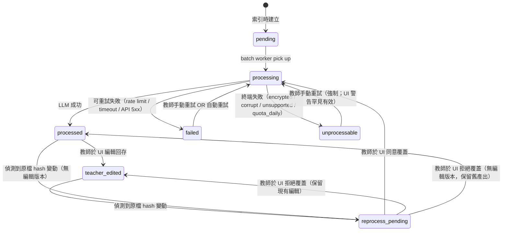

# DESIGN-001: Detailed Design

| Field | Value |
|-------|-------|
| **Status** | Draft v0.1 |
| **Date** | 2026-05-10 |
| **Owner** | Steven Chen |
| **Depends on** | [`PRD.md`](PRD.md) v0.2, [`adr/ADR-001-system-foundation.md`](adr/ADR-001-system-foundation.md), [`ARCH-001-architecture.md`](ARCH-001-architecture.md) |
| **Consumers** | UIUX-001, BDD-001, TDD-001 |

---

## 0. Document Control

| Version | Date | Author | Change |
|---------|------|--------|--------|
| 0.1 | 2026-05-10 | Steven (with Claude Code) | Initial — service contracts, error matrix, config plumbing, OAQ resolutions |

**Reading order**:
- §2 OAQ Resolutions → §3 Updated State Machine (must read; affects schema)
- §4 Service Contracts (the meat — 8 services)
- §5 Configuration → §6 Error Handling → §7 Write Queue (cross-cutting)
- §8 Document Extractors → §9 Schema Additions (specific subsystems)

---

## 1. Context

ARCH-001 froze module names and data flow. DESIGN-001 freezes the **per-module API contracts** — the function signatures, types, and errors that subsequent implementation work must conform to.

Where ARCH-001 said "the LLM Service does X", this doc says:

```python
class LLMService:
    async def call(
        self,
        tier: TaskTier,
        anonymized_prompt: str,
        ...
    ) -> LLMCallResult: ...
```

Concrete enough that BDD/TDD can write `Given the LLMService receives ...` with confidence.

---

## 2. Resolution of ARCH-001 Open Architectural Questions

> Each OAQ from ARCH-001 §9 is resolved here. Decisions that **alter PRD** are flagged for DECISIONS.md entry.

### 2.1 OAQ-1: Add `unprocessable` (terminal) state? — **ACCEPTED**

**Decision**: Update PRD §4.3 state machine to add `unprocessable` as a terminal state separate from `failed` (retriable).

**Trigger**: Lessons-learned `architecture.md` "Distinguish Terminal Failures from Retriable Failures" — observed failure mode in past projects: bulk retries hammer permanently-broken files (encrypted, corrupt, unsupported), wasting LLM cost.

**Updated state machine** (replaces PRD §4.3):

**易讀說明 — 加入 `unprocessable` 後的轉移表**：

| From | Trigger | To | 自動重試？ |
|------|---------|----|-----------|
| `(initial)` | 索引時建立 | `pending` | — |
| `pending` | batch worker pick up | `processing` | — |
| `processing` | LLM 成功 | `processed` | — |
| `processing` | rate_limit / timeout / 5xx | `failed` | ✓ ≤3 次 exponential backoff (10s/60s/300s) |
| `processing` | encrypted / corrupt / unsupported / quota_daily | `unprocessable` | **✗（從不自動重試）** |
| `failed` | 教師手動重試 OR 自動重試 | `processing` | — |
| `unprocessable` | 教師手動重試（強制；UI 警告罕見有效） | `processing` | ✗ 僅手動 |
| `processed` | 教師於 UI 編輯回存 | `teacher_edited` | — |
| `teacher_edited` | 偵測到原檔 hash 變動 | `reprocess_pending` | — |
| `processed` | 偵測到原檔 hash 變動 | `reprocess_pending` | — |
| `reprocess_pending` | 教師同意覆蓋 | `processing` | — |
| `reprocess_pending` | 教師拒絕（保留現有編輯） | `teacher_edited` | — |
| `reprocess_pending` | 教師拒絕（無編輯版本） | `processed` | — |

**`failed` 與 `unprocessable` 的差異**（D-2026-05-10-04 重點）：

| 特性 | `failed` | `unprocessable` |
|------|---------|-----------------|
| 性質 | Soft-terminal（可重試） | Hard-terminal（除非教師強制） |
| 自動 retry | ✓ exponential backoff ≤3 次 | ✗ 從不 |
| Bulk retry 預設包含 | ✓ | ✗ |
| UI 顯示 | `[重試]` 按鈕（default 動作） | `[強制重試]` 在 disclosure 後（小） |
| 顏色 | 紅 `#b03030` | 暗紅 `#7a1f1f`（更終端） |
| 典型原因 | API 5xx, timeout, rate limit | encrypted, corrupt, unsupported format, daily quota |

**Mermaid（機器精確版）**：



**Schema change**:
```sql
-- processed_artifact.state CHECK constraint update:
state TEXT NOT NULL CHECK (state IN
  ('pending', 'processing', 'processed',
   'teacher_edited', 'reprocess_pending',
   'failed', 'unprocessable'))  -- 'unprocessable' added
```

**Differential UI behavior**:
- `failed` (red) — `[重試]` button is **default** action; auto-retry up to 3x in batch
- `unprocessable` (dark red) — `[重試]` button **hidden behind disclosure** ("rarely useful — file may be encrypted/corrupt"); excluded from bulk retry

**Action**: Log as `D-2026-05-10-04` in DECISIONS.md (Reverses fragment of D-04 PRD §4.3).

### 2.2 OAQ-2: In-process worker vs separate worker container? — **CONFIRMED in-process for V1**

**Decision**: Worker runs as `asyncio` task pool in the same FastAPI process (per ARCH §6.4).

**Rationale**:
- Scale (40 students × 40 docs / semester) far below threshold needing process split
- Single process = shared connection pools, no IPC, simpler deployment
- V2 escape hatch: `arq` task queue + Redis if scale demands

**No PRD change**.

### 2.3 OAQ-3: Frontend served by FastAPI or separate Next.js server? — **DECISION: single container, two processes behind one reverse-proxy**

> **Status (2026-05-13)**: Original §2.3 below specified a single `/api/*` prefix.
> Implementation (Phase 6, [D-2026-05-10-12](adr/DECISIONS.md)) deviated to **per-feature
> prefixes** (`/auth/*`, `/drive/*`, `/eval/*`, `/batch/*`, `/pii/*`, `/onboarding/*`,
> `/settings/*`, `/file/*`, plus bare `/me`, `/healthz`, `/readyz`). [D-2026-05-10-23](adr/DECISIONS.md)
> ratifies this deviation as the official design after weighing refactor cost; future
> backend routers MUST add their prefix to `frontend/next.config.mjs` rewrites in the
> same commit. Caddyfile prod config routes the same prefix list to `:8000`, everything
> else (including bare frontend pages `/onboarding`, `/batch`, `/pii`, `/settings`) to `:3000`.

**Decision**: One Docker container, FastAPI serves a fixed list of per-feature prefixes; Next.js standalone server handles everything else.

**Layout**:
```
/app
├── backend/         # FastAPI (uvicorn on 8000 internal)
└── frontend/.next/standalone/   # Next.js standalone (3000 internal)
```

**Routing** (in entrypoint):
```bash
# entrypoint.sh
node frontend/.next/standalone/server.js &  # 3000
uvicorn backend.app.main:app --port 8000 &  # 8000
caddy run --config /etc/caddy/Caddyfile     # 443 → routes backend prefixes → 8000, * → 3000
```

**Caddyfile sketch** (prod):
```caddy
teacher.example.com {
  @backend path /auth/* /drive/* /onboarding/* /file/* /eval/* /batch/* /pii/* /settings/* /me /healthz /readyz
  reverse_proxy @backend localhost:8000
  reverse_proxy localhost:3000  # default: frontend
}
```

**Dev equivalent**: `frontend/next.config.mjs` rewrites the same prefix list to `http://localhost:8000`; the browser sees same-origin (`:3000`) so cookies attach without CORS.

**Why bundled**: avoids CORS, simplifies session cookie scope (Axis 1 single-tenant).

**No PRD change**, but added to ARCH §5.1 deployment topology.

### 2.4 OAQ-4: Frontend session cookie scope (same domain vs subdomain)? — **DECISION: same domain V1**

**Decision**: Frontend and backend served from same domain (`teacher.example.com`); cookie scope `Path=/`, `SameSite=Lax`.

**Subdomain split** out of scope for V1.

**No PRD change**.

### 2.5 OAQ-5: Add `system_event` table for non-LLM audit? — **ACCEPTED**

**Decision**: Add `system_event` table to capture login attempts, key rotations, schema migrations, attestation events.

**Schema** (V1):
```sql
CREATE TABLE system_event (
  id              TEXT PRIMARY KEY,
  teacher_id      TEXT REFERENCES teacher(id),  -- nullable for system-only events
  event_type      TEXT NOT NULL CHECK (event_type IN (
                    'oauth_login', 'oauth_logout', 'oauth_revoked',
                    'attestation_signed', 'attestation_invalidated',
                    'key_rotated', 'schema_migrated',
                    'batch_started', 'batch_completed', 'batch_failed',
                    'pii_leakage_detected'  -- alert!
                  )),
  details         TEXT,                          -- JSON payload
  ip_address      TEXT,                          -- nullable; from request context
  user_agent      TEXT,                          -- nullable
  created_at      TEXT DEFAULT CURRENT_TIMESTAMP
);

CREATE INDEX idx_system_event_teacher_time ON system_event (teacher_id, created_at);
CREATE INDEX idx_system_event_type ON system_event (event_type);
```

**Action**: Log as `D-2026-05-10-05` in DECISIONS.md (additive — no PRD reversal needed).

---

## 3. Updated State Machine Summary

After OAQ-1 acceptance:

| State | Transitions IN | Transitions OUT | Terminal? |
|-------|---------------|-----------------|-----------|
| `pending` | initial | → `processing` | No |
| `processing` | from `pending`, `failed`, `unprocessable`, `reprocess_pending` | → `processed`, `failed`, `unprocessable` | No |
| `processed` | from `processing` | → `teacher_edited`, `reprocess_pending` | No (sticky-ish) |
| `teacher_edited` | from `processed`, `reprocess_pending` (keep) | → `reprocess_pending` | No (sticky-ish) |
| `reprocess_pending` | from `processed`, `teacher_edited` | → `processing`, `teacher_edited`, `processed` | No |
| `failed` | from `processing` | → `processing` (retry) | Soft-terminal (auto-retry capped) |
| `unprocessable` | from `processing` | → `processing` (manual retry only) | Hard-terminal |

**Auto-retry policy**:
- `failed` → `processing` happens automatically up to 3x with exponential backoff (10s / 60s / 300s)
- After 3rd failure, stays in `failed` until manual retry
- `unprocessable` is **never auto-retried**

---

## 4. Service Contracts

> Each service is presented as a Python protocol-style class skeleton. Real implementations may add helpers, but **the public method signatures are frozen** by this doc.

### 4.1 PIIAnonymizer (chokepoint #1)

```python
# app/services/pii_anonymizer.py

from typing import Protocol
from pydantic import BaseModel

class PIIType(str, Enum):
    STUDENT_NAME = "student_name"
    STUDENT_ID = "student_id"
    PARENT_NAME = "parent_name"
    PHONE = "phone"
    EMAIL = "email"
    OTHER_NAME = "other_name"
    OTHER = "other"

class PIIMappingEntry(BaseModel):
    pseudonym: str           # e.g. 'S001'
    pii_type: PIIType
    display_name: str | None  # what teacher sees
    source: Literal["auto", "manual"]

class AnonymizeResult(BaseModel):
    anonymized_text: str
    replacements: int        # how many PII items substituted
    new_mappings_added: int  # how many fresh pii_mapping rows created

class PIIAnonymizer:
    """Chokepoint for all PII transforms. Stateful (caches mapping in-memory
    per teacher_id; flushes via DBWriteQueue on new entries)."""

    def __init__(self, db_write_queue: DBWriteQueue, encryption: EncryptionService): ...

    async def anonymize(
        self,
        text: str,
        teacher_id: UUID,
        *,
        strict: bool = True,  # if True, raise PIIDetectionError if confidence low
    ) -> AnonymizeResult:
        """Replace PII in `text` with stable pseudonyms.

        Side-effects: may insert new pii_mapping rows.

        Detection layers (V1):
        1. Strong-signal lookup: any value matching `drive_file.student_pseudo_id`
           reverse map → sub directly
        2. Regex layer: Taiwan phone (`09\\d{8}`, `0\\d{1,2}-\\d{6,8}`),
           Email (`[a-z0-9._%+-]+@...`), Taiwan ID (one-letter + 9 digits)
        3. Folder-name strong signals: any token equal to a known
           student-folder name → sub student_name pseudonym

        Raises:
          PIIEncryptionError: if EncryptionService fails
          DBWriteError: if write queue fails
        """

    async def restore(
        self,
        text: str,
        teacher_id: UUID,
    ) -> str:
        """Substitute pseudonyms in `text` with `display_name` (or original_value
        if display_name is null).

        Idempotent: text without pseudonyms returns unchanged.

        Raises:
          PIIRestorationError: if pseudonym pattern matched but no mapping found
            (catastrophic; indicates anonymizer/restorer drift)
        """

    async def list_mappings(self, teacher_id: UUID) -> list[PIIMappingEntry]:
        """For PII Min UI (PRD F-6 / D13)."""

    async def update_display_name(
        self, teacher_id: UUID, pseudonym: str, display_name: str
    ) -> None:
        """Teacher renames pseudonym display."""

    async def add_manual_mapping(
        self,
        teacher_id: UUID,
        original_value: str,
        pseudonym: str,           # must match an existing auto pseudonym
        pii_type: PIIType,
    ) -> PIIMappingEntry:
        """Teacher adds an alias (e.g., '阿明' also → S001).

        Raises:
          ValueError: if pseudonym does not exist for teacher
        """
```

**Test seam**: All tests construct `PIIAnonymizer` with `MockDBWriteQueue` + `MockEncryptionService`; never touch real DB or AES.

### 4.2 LLMService (chokepoint #2)

```python
# app/services/llm_service.py

class TaskTier(str, Enum):
    SUMMARY_CHEAP = "summary_cheap"
    VISION_CHEAP = "vision_cheap"
    AUDIO_STANDARD = "audio_standard"
    EVALUATION_QUALITY = "evaluation_quality"

class LLMInput(BaseModel):
    """Input may include images/audio for multimodal tiers."""
    text: str
    image_bytes: bytes | None = None     # for vision_cheap
    audio_bytes: bytes | None = None     # for audio_standard
    response_format: Literal["text", "json"] = "text"

class LLMCallResult(BaseModel):
    output_text: str            # ALREADY PII-restored
    raw_output_text: str        # PII-anonymized (for audit)
    model_used: str
    input_tokens: int
    output_tokens: int
    cost_usd: Decimal
    audit_id: UUID              # llm_call_audit.id

class LLMService:
    """The ONLY path to OpenRouter. Enforces PII anonymizer pre-call."""

    def __init__(
        self,
        settings: Settings,
        anonymizer: PIIAnonymizer,
        openrouter: OpenRouterClient,
        audit: AuditLogger,
    ):
        # Tier→model resolved from settings (via __init__) — see §5
        self._tier_to_model: dict[TaskTier, str] = {
            TaskTier.SUMMARY_CHEAP: settings.llm_tier_summary_cheap,
            ...
        }

    async def call(
        self,
        tier: TaskTier,
        teacher_id: UUID,
        prompt: LLMInput,
        *,
        retry: int = 3,
    ) -> LLMCallResult:
        """Anonymize → boundary-check → call → restore.

        Process:
        1. anonymized = anonymizer.anonymize(prompt.text, teacher_id)
        2. assert no_pii_in_anonymized(anonymized.anonymized_text)  # boundary
        3. response = openrouter.chat(model=tier→model, ...)
        4. restored = anonymizer.restore(response.text, teacher_id)
        5. audit.record(...)

        Raises:
          PIILeakageError: boundary check (step 2) found PII still present
            after anonymizer ran. Triggers system_event 'pii_leakage_detected'.
          LLMRateLimitError: 429 from OpenRouter; retry exhausted.
          LLMTimeoutError: timeout; retry exhausted.
          LLMQuotaExceededError: daily quota hit (per lessons-learned
            architecture.md "Distinguish Temporary Rate Limits from
            Daily Quota Exhaustion" — pauses batch).
          ConfigError: if tier→model resolution returns empty string
            (per lessons-learned "Declared Config Must Be Plumbed").
        """

    async def call_with_retry_classification(
        self,
        tier: TaskTier,
        teacher_id: UUID,
        prompt: LLMInput,
    ) -> LLMCallResult | Literal["UNPROCESSABLE"]:
        """Wrapper for batch worker — distinguishes terminal vs retriable.
        Returns 'UNPROCESSABLE' for terminal LLM failures (model deprecated,
        invalid response shape) so worker can transition to unprocessable
        instead of failed."""
```

**Boundary check** (`_no_pii_in_anonymized`) is the load-bearing safety net:
```python
PII_BOUNDARY_PATTERNS = [
    re.compile(r"09\d{8}"),                                    # TW mobile
    re.compile(r"0\d{1,2}-\d{6,8}"),                           # TW landline
    re.compile(r"[a-zA-Z0-9._%+-]+@[a-zA-Z0-9.-]+\.[a-z]{2,}"), # email
    re.compile(r"[A-Z]\d{9}"),                                 # TW national ID
    # Note: name detection here is intentionally absent — names are too
    # variable for a regex catch-net; rely on anonymizer's strong-signal
    # detection. This boundary catches "obvious" PII as a tripwire.
]

def no_pii_in_anonymized(text: str) -> bool:
    return not any(p.search(text) for p in PII_BOUNDARY_PATTERNS)
```

### 4.3 AuthService

```python
# app/services/auth_service.py

class TeacherSessionContext(BaseModel):
    teacher_id: UUID
    google_sub: str
    email: str
    has_attested: bool
    has_drive_root: bool

class AuthService:
    def __init__(
        self,
        settings: Settings,
        encryption: EncryptionService,
        db_write_queue: DBWriteQueue,
    ): ...

    async def begin_oauth(self, redirect_uri: str) -> str:
        """Returns Google OAuth authorize URL."""

    async def complete_oauth(self, code: str, state: str) -> TeacherSessionContext:
        """Exchange code, persist encrypted refresh_token, return context.

        For V1 single-user enforcement: if a teacher row already exists with a
        different google_sub, raise SingleUserViolationError (UI shows "this
        instance is bound to <other_email>").
        """

    async def get_drive_token(self, teacher_id: UUID) -> str:
        """Lazy refresh. Returns valid access_token. May call Google to refresh.

        Raises:
          OAuthRevokedError: refresh_token rejected (user revoked grant);
            UI must redirect to /login.
        """

    async def attest(self, teacher_id: UUID, version: str) -> None:
        """Record consent attestation (D17)."""

    async def attestation_required(self, teacher_id: UUID) -> bool:
        """Compare current attestation version vs the one teacher signed.
        Returns True if must re-sign (e.g., new version published)."""

    async def revoke(self, teacher_id: UUID) -> None:
        """Call Google revocation endpoint, clear stored token, log out."""
```

### 4.4 DriveSyncService

```python
# app/services/drive_sync_service.py

class DriveTreeNode(BaseModel):
    drive_file_id: str
    name: str
    is_folder: bool
    children: list["DriveTreeNode"] | None = None  # only when expanded

class ScanResult(BaseModel):
    semesters_found: int
    students_found: int
    files_indexed: int
    files_unchanged: int      # hash matched, skipped
    needs_folder_mapping: bool

class DriveSyncService:
    def __init__(
        self,
        auth: AuthService,
        drive_client: DriveClient,
        anonymizer: PIIAnonymizer,
        db_write_queue: DBWriteQueue,
    ): ...

    async def list_root_candidates(self, teacher_id: UUID) -> list[DriveTreeNode]:
        """For onboarding 'pick root folder' UI. Lists user's My Drive folders only."""

    async def list_children(
        self, teacher_id: UUID, folder_id: str
    ) -> list[DriveTreeNode]:
        """Lazy load for tree UI."""

    async def scan_root(self, teacher_id: UUID) -> ScanResult:
        """Walk 3-level structure: semester / student / category.

        On encountering a non-standard category folder name, sets
        ScanResult.needs_folder_mapping = True and **suspends** further scan.
        Caller (onboarding flow) shows wizard, then calls resume_scan.

        Idempotent: re-scanning skips files where drive_modified_at and
        content_hash both unchanged.
        """

    async def resume_scan(self, teacher_id: UUID) -> ScanResult:
        """After folder_mapping is set, complete the suspended scan."""

    async def download_file(
        self, teacher_id: UUID, drive_file_id: str
    ) -> bytes:
        """Download file content. Caller responsible for cleanup."""

    async def stream_audio(
        self, teacher_id: UUID, drive_file_id: str
    ) -> AsyncIterator[bytes]:
        """Stream large audio files to avoid loading >100MB into memory."""
```

### 4.5 ProcessingPipeline

```python
# app/services/processing_pipeline.py

class ProcessingResult(BaseModel):
    artifact_type: Literal["markdown_summary", "transcript"]
    content_markdown: str            # PII-restored
    raw_anonymized_markdown: str     # for audit
    llm_tier: TaskTier
    llm_model: str
    llm_cost_usd: Decimal
    audit_id: UUID

class ProcessingPipeline:
    """Orchestrates: download → extract → anonymize → LLM → restore → return.
    Pure (no DB writes). Caller (BatchWorker) persists the result."""

    def __init__(
        self,
        drive_sync: DriveSyncService,
        document_extractors: DocumentExtractorRegistry,
        llm: LLMService,
        anonymizer: PIIAnonymizer,
    ): ...

    async def process(
        self,
        teacher_id: UUID,
        drive_file: DriveFileRecord,
    ) -> ProcessingResult:
        """Route by category × mime_type:

        category=learning|work × text|docx|xlsx|pptx|pdf → summary_cheap (text)
        category=learning|work × image → vision_cheap
        category=interaction × audio → audio_standard

        Raises:
          UnsupportedFormatError: terminal — caller transitions to unprocessable
          DocumentExtractionError: terminal — corrupt file
          LLMRateLimitError / LLMTimeoutError: retriable — caller transitions
            to failed (will retry)
          LLMQuotaExceededError: pauses batch (caller handles)
        """
```

### 4.6 BatchWorker

```python
# app/services/batch_worker.py

class BatchJobUpdate(BaseModel):
    """SSE event payload."""
    batch_job_id: UUID
    state: Literal["running", "paused", "completed", "failed"]
    completed: int
    failed: int
    unprocessable: int
    skipped: int
    total: int
    cost_so_far_usd: Decimal
    last_event: dict | None  # most recent file event

class BatchWorker:
    def __init__(
        self,
        settings: Settings,        # for concurrency, budget
        pipeline: ProcessingPipeline,
        db_write_queue: DBWriteQueue,
        sse: SSEPublisher,
    ): ...

    async def start_job(
        self,
        teacher_id: UUID,
        semester_label: str,
        decisions: dict[UUID, Literal["overwrite", "keep"]],  # for reprocess_pending
    ) -> UUID:
        """Create batch_job, enqueue files, return batch_job_id.
        Returns immediately; processing happens in background tasks."""

    async def cancel_job(self, batch_job_id: UUID) -> None:
        """Soft-cancel: mark processing files as 'pending', no new tasks
        picked up."""

    async def get_status(self, batch_job_id: UUID) -> BatchJobUpdate:
        """Snapshot for polling fallback (when SSE not available)."""

    async def recover_stale_jobs(self) -> int:
        """Called on startup. Resets state='processing' AND updated_at older
        than 5 minutes back to 'pending'. Returns count recovered."""
```

**Internal worker loop** (not exposed):
```python
async def _worker_loop(self, batch_job_id, semaphore: asyncio.Semaphore):
    while not self._cancelled[batch_job_id]:
        artifact_id = await self._task_queue.get()
        async with semaphore:  # concurrency limit
            try:
                result = await self.pipeline.process(...)
                await self._mark_processed(artifact_id, result)
            except (UnsupportedFormatError, DocumentExtractionError) as e:
                await self._mark_unprocessable(artifact_id, e)
            except (LLMRateLimitError, LLMTimeoutError) as e:
                await self._mark_failed_with_retry(artifact_id, e)
            except LLMQuotaExceededError:
                await self._pause_job(batch_job_id, reason="quota_exhausted")
                break
```

### 4.7 EvaluationGenerator

```python
# app/services/evaluation_generator.py

class EvaluationStyle(str, Enum):
    FORMAL = "formal"          # 正式
    ENCOURAGING = "encouraging" # 鼓勵
    OBJECTIVE = "objective"    # 客觀

class EvaluationContext(BaseModel):
    seed_text: str             # teacher's 30-100 char input
    style: EvaluationStyle
    learning_summaries: list[str]
    interaction_transcripts: list[str]
    work_summaries: list[str]

class GeneratedEvaluation(BaseModel):
    evaluation_id: UUID
    text: str                  # PII-restored
    char_count: int
    style: EvaluationStyle
    llm_cost_usd: Decimal

class EvaluationGenerator:
    def __init__(
        self,
        llm: LLMService,
        anonymizer: PIIAnonymizer,
        db_write_queue: DBWriteQueue,
    ): ...

    async def gather_context(
        self, teacher_id: UUID, semester_label: str, pseudo_id: str
    ) -> EvaluationContext:
        """Pull processed_artifact rows for student × semester × all 3 categories.
        Truncate per-category to 8K tokens (rough estimate; exact in prompt builder)."""

    async def generate(
        self,
        teacher_id: UUID,
        semester_label: str,
        pseudo_id: str,
        seed_text: str,
        style: EvaluationStyle,
    ) -> GeneratedEvaluation:
        """Full pipeline: gather → build prompt → LLM → restore → persist.
        Style-aware prompt selection (see Appendix B in PRD)."""

    async def regenerate(
        self, evaluation_id: UUID, new_seed: str | None, new_style: EvaluationStyle | None
    ) -> GeneratedEvaluation:
        """Generate new version; updates same evaluation_id row."""

    async def save_edit(
        self, evaluation_id: UUID, edited_text: str
    ) -> None: ...
```

### 4.8 AuditLogger

```python
# app/services/audit_logger.py

class AuditLogger:
    def __init__(self, db_write_queue: DBWriteQueue): ...

    async def log_llm_call(
        self,
        teacher_id: UUID,
        tier: TaskTier,
        model_id: str,
        input_tokens: int,
        output_tokens: int,
        cost_usd: Decimal,
        pii_replacement_count: int,
    ) -> UUID:
        """Insert llm_call_audit row. Returns id for cross-reference."""

    async def log_system_event(
        self,
        event_type: SystemEventType,
        teacher_id: UUID | None,
        details: dict,
        ip_address: str | None = None,
        user_agent: str | None = None,
    ) -> None:
        """Insert system_event row (per OAQ-5 / D-2026-05-10-05)."""

    async def cost_summary(
        self, teacher_id: UUID, since: datetime, until: datetime | None = None
    ) -> CostBreakdown:
        """Aggregated by tier."""
```

### 4.9 EncryptionService

```python
# app/services/encryption.py

class EncryptionService:
    """AES-256-GCM with per-record nonce. Keys from settings (env)."""

    def __init__(self, settings: Settings):
        self._oauth_key = settings.oauth_token_encryption_key.get_secret_value()
        self._pii_key = settings.pii_encryption_key.get_secret_value()

    def encrypt_oauth_token(self, plaintext: str) -> bytes:
        """Returns nonce(12) || ciphertext(...) || tag(16)."""

    def decrypt_oauth_token(self, blob: bytes) -> str: ...

    def encrypt_pii(self, plaintext: str) -> bytes: ...
    def decrypt_pii(self, blob: bytes) -> str: ...
```

**Key rotation CLI** (admin-only, manual):
```bash
python -m app.cli rotate-key --type oauth --new-key=<base64>
python -m app.cli rotate-key --type pii --new-key=<base64>
```

Rotation reads all encrypted blobs, re-encrypts under new key, writes back. Atomic per row (no half-rotated state). If interrupted, idempotent on resume.

---

## 5. Configuration Schema

### 5.1 Full `Settings` class

```python
# app/config.py

from pydantic_settings import BaseSettings
from pydantic import SecretStr, AnyHttpUrl
from decimal import Decimal

class Settings(BaseSettings):
    # Required (system fails to start if missing)
    database_url: str
    google_client_id: SecretStr
    google_client_secret: SecretStr
    openrouter_api_key: SecretStr
    pii_encryption_key: SecretStr        # base64 32 bytes
    oauth_token_encryption_key: SecretStr  # base64 32 bytes
    public_base_url: AnyHttpUrl
    session_secret_key: SecretStr        # for cookie signing

    # LLM tier defaults — overridable
    llm_tier_summary_cheap: str = "google/gemini-2.5-flash-lite"
    llm_tier_vision_cheap: str = "google/gemini-2.5-flash-lite"
    llm_tier_audio_standard: str = "google/gemini-2.5-flash-lite"
    llm_tier_evaluation_quality: str = "google/gemini-2.5-flash-lite"

    # Tunables
    batch_worker_concurrency: int = 4
    budget_monthly_usd: Decimal = Decimal("5.00")
    sqlite_busy_timeout_ms: int = 5000

    # Optional infra
    sentry_dsn: str | None = None
    log_level: str = "INFO"

    class Config:
        env_file = ".env"
        env_file_encoding = "utf-8"
```

### 5.2 Tier-to-model resolution

```python
# app/services/llm_service.py (excerpt)

class LLMService:
    def __init__(self, settings: Settings, ...):
        # Wire config to behavior — single source of truth
        self._tier_to_model = {
            TaskTier.SUMMARY_CHEAP: settings.llm_tier_summary_cheap,
            TaskTier.VISION_CHEAP: settings.llm_tier_vision_cheap,
            TaskTier.AUDIO_STANDARD: settings.llm_tier_audio_standard,
            TaskTier.EVALUATION_QUALITY: settings.llm_tier_evaluation_quality,
        }
        # Fail-fast: empty string = misconfigured
        for tier, model_id in self._tier_to_model.items():
            if not model_id:
                raise ConfigError(f"LLM tier {tier} has empty model_id")
```

### 5.3 Configuration drift prevention

Per lessons-learned `architecture.md` "Declared Config Must Be Plumbed":

**CI test** (in `tests/test_config_plumbing.py`):
```python
def test_no_hardcoded_models_in_services():
    """Ensure no service hardcodes a model ID; all must come from settings."""
    import re
    KNOWN_PROVIDERS = ["google/", "anthropic/", "openai/", "meta-llama/"]
    for path in pathlib.Path("backend/app/services").rglob("*.py"):
        content = path.read_text()
        for provider in KNOWN_PROVIDERS:
            assert provider not in content, \
                f"Hardcoded model ID found in {path}; use settings.llm_tier_*"
```

**Lint also enforces**: `LLMService` must accept `settings: Settings` parameter (otherwise it can't read tier config).

---

## 6. Error Handling Matrix

### 6.1 Exception hierarchy (canonical, replaces ARCH-001 §6.3 sketch)

```python
# app/core/exceptions.py

class AppError(Exception):
    """Base — all app-specific exceptions inherit from this."""
    http_status: int = 500
    user_message_zh: str = "系統發生錯誤"

class AuthError(AppError):
    http_status = 401

class OAuthRevokedError(AuthError):
    user_message_zh = "Google 授權已撤銷，請重新登入"

class AttestationRequiredError(AuthError):
    http_status = 412
    user_message_zh = "請先完成家長同意聲明"

class SingleUserViolationError(AuthError):
    http_status = 403
    user_message_zh = "本系統實例已綁定其他帳號"

class DriveError(AppError):
    http_status = 502  # bad gateway

class DriveQuotaExceededError(DriveError):
    http_status = 429
    user_message_zh = "Google Drive API 配額用罄，請稍後再試"

class DriveFileNotFoundError(DriveError):
    http_status = 404

# Processing — clearly distinguish terminal vs retriable
class ProcessingError(AppError): ...

class TerminalProcessingError(ProcessingError):
    """Maps to state='unprocessable'. Auto-retry must NOT happen."""

class UnsupportedFormatError(TerminalProcessingError):
    user_message_zh = "不支援的檔案格式"

class DocumentExtractionError(TerminalProcessingError):
    user_message_zh = "檔案損毀無法解析"

class RetriableProcessingError(ProcessingError):
    """Maps to state='failed'. Auto-retry up to 3x."""

class LLMRateLimitError(RetriableProcessingError):
    http_status = 429

class LLMTimeoutError(RetriableProcessingError):
    http_status = 504

class LLMQuotaExceededError(ProcessingError):
    """Special: pauses batch (per architecture.md 'Distinguish Temporary
    Rate Limits from Daily Quota Exhaustion'). NOT auto-retried."""
    http_status = 429
    user_message_zh = "LLM 每日配額已用罄"

class PIIError(AppError):
    http_status = 500

class PIILeakageError(PIIError):
    """ALERT — boundary check failed. Triggers system_event."""
    user_message_zh = "PII 安全檢查失敗（已記錄）"

class PIIRestorationError(PIIError):
    """Pseudonym matched but no mapping. Display falls back to original
    pseudonym text (e.g., 'S001')."""

class PIIDetectionError(PIIError):
    """Anonymizer in strict mode rejected low-confidence text."""

class ConfigError(AppError):
    http_status = 500  # but should fail at startup, not runtime
```

### 6.2 HTTP routing rules (FastAPI handler)

```python
# app/main.py
@app.exception_handler(AppError)
async def app_error_handler(request: Request, exc: AppError):
    return JSONResponse(
        status_code=exc.http_status,
        content={
            "error": exc.__class__.__name__,
            "message": exc.user_message_zh,
            "details": str(exc) if settings.log_level == "DEBUG" else None,
        }
    )
```

### 6.3 Worker error → state mapping

| Exception class | Worker action | Persisted state | Auto-retry? |
|----------------|---------------|-----------------|-------------|
| `UnsupportedFormatError` | log, mark | `unprocessable` | No |
| `DocumentExtractionError` | log, mark | `unprocessable` | No |
| `LLMRateLimitError` | exponential backoff retry | `failed` (if retries exhausted) | Yes (≤3) |
| `LLMTimeoutError` | exponential backoff retry | `failed` (if retries exhausted) | Yes (≤3) |
| `LLMQuotaExceededError` | pause batch, alert UI | (artifact stays `processing`; rolls back to `pending` on resume) | No (manual resume) |
| `PIILeakageError` | log critical, alert via system_event, mark | `unprocessable` (require manual intervention) | No |
| `OAuthRevokedError` | pause batch, alert UI | (artifact stays `processing`; rolls back) | No |
| Any other unexpected `Exception` | log critical, mark | `failed` (will retry once) | Yes (1) — then `unprocessable` |

### 6.4 Sentinel HTTP responses

| HTTP | Scenario | Frontend action |
|------|----------|-----------------|
| 401 + `OAuthRevokedError` | Drive token revoked | Redirect to /login |
| 412 + `AttestationRequiredError` | Attestation expired | Redirect to /onboarding/attestation |
| 403 + `SingleUserViolationError` | Wrong account | Show error page (no redirect — user must contact admin) |
| 429 + `DriveQuotaExceededError` | Drive throttled | Show banner; auto-retry on 429 with `Retry-After` |
| 429 + `LLMRateLimitError` | OpenRouter throttled | Show banner during batch |
| 502 + `DriveError` | Drive down | Show error toast; manual retry |
| 5xx unhandled | Last resort | Generic error page; Sentry capture if configured |

---

## 7. Database Write Queue (full interface)

```python
# app/db/write_queue.py

from typing import Callable, Awaitable, TypeVar
from collections import deque
from time import monotonic

T = TypeVar("T")

class DBWriteQueueMetrics(BaseModel):
    queue_depth: int
    writes_per_second: float
    avg_wait_ms: float
    failed_writes: int

class DBWriteQueue:
    def __init__(self, session_factory: Callable[[], AsyncSession]):
        self._queue: asyncio.Queue = asyncio.Queue()
        self._metrics = DBWriteQueueMetrics(...)
        self._task: asyncio.Task | None = None

    async def start(self) -> None:
        """Spin up the drainer task. Called from FastAPI lifespan."""
        self._task = asyncio.create_task(self._drain())

    async def stop(self) -> None:
        """Drain remaining items, then exit. Called from lifespan shutdown."""

    async def submit(
        self, write_fn: Callable[[AsyncSession], Awaitable[T]]
    ) -> T:
        """Submit a write closure. Awaits the result.

        Raises:
          DBWriteError: if the write closure raised (re-raised here)
          asyncio.QueueFull: if queue is at capacity (V1: unbounded; V2 add cap)
        """
        future: asyncio.Future[T] = asyncio.Future()
        await self._queue.put((write_fn, future, monotonic()))
        return await future

    @property
    def metrics(self) -> DBWriteQueueMetrics: ...

    async def _drain(self) -> None:
        """Single-writer loop. Drains queue, commits per item."""
        async with self._session_factory() as session:
            while True:
                write_fn, future, enqueued_at = await self._queue.get()
                wait_ms = (monotonic() - enqueued_at) * 1000
                self._metrics.avg_wait_ms = ...  # rolling avg
                try:
                    result = await write_fn(session)
                    await session.commit()
                    future.set_result(result)
                except Exception as e:
                    await session.rollback()
                    future.set_exception(DBWriteError(str(e)))
                    self._metrics.failed_writes += 1
```

**Backpressure observation**: when `queue_depth > 100`, log warning. When `> 1000`, refuse new submissions (raise QueueFull) — defensive cap for V2.

---

## 8. Document Extraction Adapters

### 8.1 Interface

```python
# app/adapters/document_extractors/__init__.py

class ExtractionResult(BaseModel):
    text: str                  # extracted plain text (UTF-8, normalized)
    has_images: bool           # if True, may also need vision pass
    page_count: int | None     # for paginated formats
    warnings: list[str]        # non-fatal issues

class DocumentExtractor(Protocol):
    async def extract(self, file_bytes: bytes, filename: str) -> ExtractionResult: ...
    def supports(self, mime_type: str, filename: str) -> bool: ...

# Registry pattern (no inheritance — Protocol structural typing per
# lessons-learned/architecture.md "Provider Abstraction with Protocol")
class DocumentExtractorRegistry:
    def __init__(self, extractors: list[DocumentExtractor]):
        self._extractors = extractors

    def get(self, mime_type: str, filename: str) -> DocumentExtractor:
        for ext in self._extractors:
            if ext.supports(mime_type, filename):
                return ext
        raise UnsupportedFormatError(f"No extractor for {mime_type} / {filename}")
```

### 8.2 Per-format adapters (V1)

| Adapter | Library | Notes |
|---------|---------|-------|
| `DocxExtractor` | `python-docx` | Tables, lists, headings preserved as Markdown |
| `XlsxExtractor` | `openpyxl` | Sheet-per-section; truncate per-sheet at 1000 rows |
| `PptxExtractor` | `python-pptx` | Slide-per-section; embedded images flagged for separate vision pass |
| `PdfExtractor` | `pypdf` | Text-only V1 (no OCR fallback); flagged-encrypted PDFs → `UnsupportedFormatError` |
| `ImageExtractor` | (none — vision LLM) | Routes directly to `vision_cheap` tier |
| `AudioExtractor` | (none — audio LLM) | Routes directly to `audio_standard` tier; audio file deleted from local cache after STT |
| `PlainTextExtractor` | stdlib | UTF-8 decoding with fallback chain (utf-8 → big5 → cp950) |

**Encrypted file detection** (per lessons-learned `architecture.md` "Substring-Based File Detection Must Be Narrowly Scoped"):
```python
class DocxExtractor:
    OLE_ENCRYPTED_SIGNATURE = b"CDFV2 Encrypted"  # narrow, OLE-specific

    async def extract(self, file_bytes: bytes, filename: str) -> ExtractionResult:
        if file_bytes[:50].startswith(b"\xd0\xcf\x11\xe0"):  # OLE container
            if self.OLE_ENCRYPTED_SIGNATURE in file_bytes[:8192]:
                raise UnsupportedFormatError("Encrypted OLE document")
        # ... parse with python-docx ...
```

PDFs are NOT pre-screened — let `pypdf` raise; encrypted-PDF errors map to `DocumentExtractionError` (terminal).

---

## 9. Schema Additions Summary (consolidated)

Beyond PRD §4.2:

```sql
-- New table per OAQ-5 / D-2026-05-10-05
CREATE TABLE system_event (...);  -- see §2.5 above

-- New `unprocessable` value in processed_artifact.state CHECK constraint
-- (see §2.1 — schema migration)
```

**Migration plan** (Alembic):
- `versions/0001_initial.py` — all PRD §4.2 tables (existing)
- `versions/0002_add_system_event.py` — new table
- `versions/0003_add_unprocessable_state.py` — modify CHECK constraint

SQLite cannot `ALTER CHECK` directly; Alembic will create new table, copy rows, drop old, rename.

---

## 10. References

- [`docs/PRD.md`](PRD.md) §4 (data model), §5 (functional reqs)
- [`docs/ARCH-001-architecture.md`](ARCH-001-architecture.md) §2 (modules), §6 (cross-cutting)
- [`docs/adr/ADR-001-system-foundation.md`](adr/ADR-001-system-foundation.md)
- `~/.claude/lessons-learned/architecture.md` — terminal vs retriable, config plumbing, narrow detection scope, provider Protocol
- `~/.claude/lessons-learned/api-design.md` — quota vs rate limit distinction
- `~/.claude/lessons-learned/testing.md` — informs §4 service test seam pattern

---

## 11. Decisions to Log in DECISIONS.md (after this doc commits)

| ID | Reverses | Decision | Rationale |
|----|----------|----------|-----------|
| `D-2026-05-10-04` | PRD §4.3 (D4 fragment) | Add `unprocessable` terminal state | lessons-learned/architecture.md prevents wasteful auto-retry on encrypted/corrupt files |
| `D-2026-05-10-05` | (additive) | Add `system_event` table | OAQ-5; non-LLM audit (login, attestation, key rotation, batch lifecycle, PII leakage alert) |

---

> **End of DESIGN-001 v0.1**. Next doc: UIUX-001 (design system extracted from mockups/, per-screen specs).
