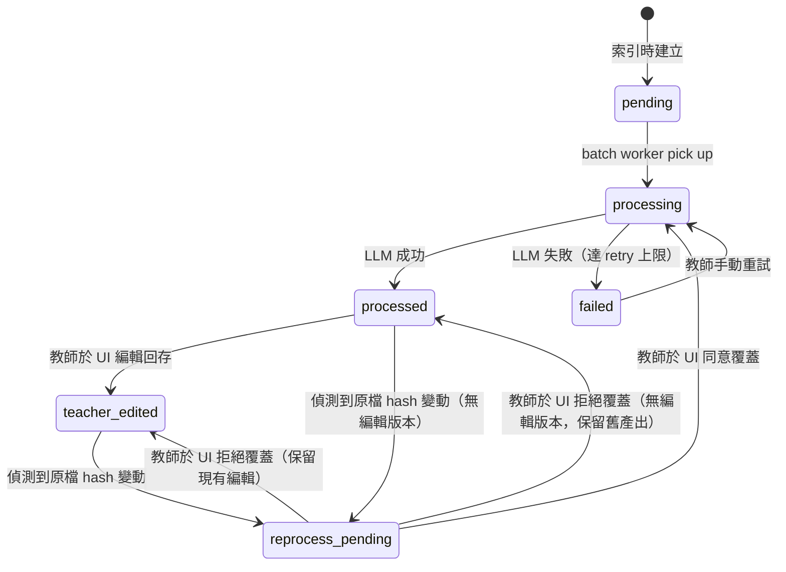
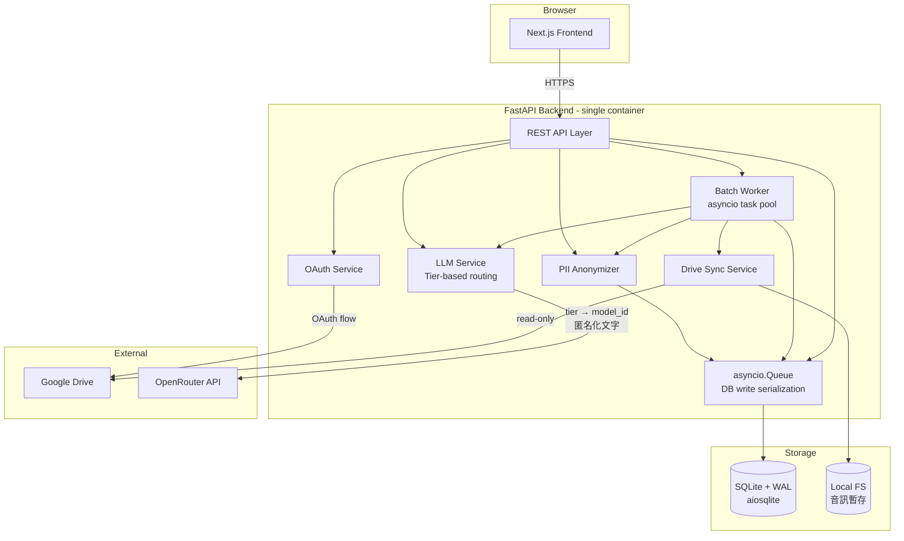

# PRD: 教師評語系統 (Teacher Comments System)

> **Document Status**: Draft v0.2 — post-OQ-review
> **Owner**: Steven Chen (`steven@chtsecurity.com`)
> **Created**: 2026-05-10 | **Last Updated**: 2026-05-10
> **Locked Decisions Reference**: see §2; full architectural rationale (with options evaluated and rejected) in [`docs/adr/ADR-001-system-foundation.md`](adr/ADR-001-system-foundation.md)

---

## 0. Document Control

| Version | Date | Author | Change |
|---------|------|--------|--------|
| 0.1 | 2026-05-10 | Steven (with Claude Code) | Initial draft after 7-baseline discussion |
| 0.2 | 2026-05-10 | Steven (with Claude Code) | Resolved all 13 Open Questions (Round 1-4 OQ review). Major changes: tier-based LLM routing, SQLite + WAL, Docker compose deploy, single-account assumption, parental-consent attestation, mapping wizard, removal of multi-account / auto-schedule / data-archive features from V1. |

**Related artifacts**:
- `docs/adr/DECISIONS.md` — chronological decision log (`D-2026-05-10-02`, `D-2026-05-10-03`)
- [`docs/adr/ADR-001-system-foundation.md`](adr/ADR-001-system-foundation.md) — architectural rationale across 7 axes (deployment, tech stack, privacy, processing model, LLM, persistence, distribution)
- `CLAUDE.md` — Claude Code session protocols

**How to read this document**:
- §2 is **locked spec** — changes require an ADR + reversal entry in DECISIONS.md
- §5 (Functional Requirements) is the contract for implementation
- §11 (Acceptance Criteria) is the contract for "done"
- §13 (Implementation TODOs) tracks deferred items that must be settled during build

---

## 1. Background & Vision

### 1.1 Problem

撰寫學期評語是教師工作中**高耗時、低重複性**的環節：

- 每位學生、每學期 1 篇，內容必須**具體、有指導性、避免套版**
- 必要的素材分散在多種媒介：學生文件、作品檔、課堂錄音、教師觀察
- 教師有意願也有素材，但「整合素材 → 寫出 300-500 字精準評語」的腦力成本造成拖延
- 套版式評語（家長一眼識破）反而傷害師生關係

### 1.2 Vision

**讓教師的評語回到「以教學觀察為基礎」的狀態，而非從零回憶**：

- 教師的所有觀察素材（檔案、錄音、文件）已被系統前處理為**可讀、可搜、可引用**的形式
- 教師輸入一段**個人化的評價種子**（30-100 字），系統在素材中找出證據、撰寫初稿
- 教師對初稿做最小化編輯（**不是改寫，是確認**）即可定稿
- **教師永遠擁有最終決定權**：所有 LLM 產出都可編輯、可拒絕、可下載

### 1.3 Success Metrics

| 指標 | 目標 | 量測方式 |
|------|------|----------|
| **單名學生產評語耗時** | 教師主觀感受 < 10 分鐘（含閱讀 + 編輯） | 上線後第一學期問卷 |
| **教師編輯比例** | LLM 初稿被修改 < 30% 字數（aspirational） | 不送回服務端，個人觀察 |
| **批次處理可恢復性** | 處理中斷後重啟，已完成項目不重複處理 | 自動化測試 |
| **隱私守則合規率** | 100% 送 LLM 的內容均經過 PII 匿名化 | 自動化驗證 + 抽樣 audit log |
| **單學期 LLM 成本** | < USD $5 / 學期（中規模 40 學生）— 預估 ~$1-2 | OpenRouter usage dashboard |

---

## 2. Locked Decisions

> **這些是 PRD 的「Locked Spec」 — 變更需經 ADR + DECISIONS.md reversal flow。** 任何 implementation 提案若違反此處任一條，必須在 proposal 中明示「Reverses: D-XXX」並提出論證。

### 2.1 Foundation Decisions（D1-D7，2026-05-10 確立）

| # | Decision | Rationale | DECISIONS.md ID |
|---|----------|-----------|-----------------|
| **D1** | **個人單機假設（單人 SaaS）** | 教師個人使用；不假設多帳號、不假設多教師、不做租戶隔離 | `D-2026-05-10-02` |
| **D2** | **Python (FastAPI) + 前端框架分離（Next.js / React）** | LLM 工具鏈與 async I/O 在 Python 生態最成熟 | `D-2026-05-10-02` |
| **D3** | **PII 匿名化前處理（送 LLM 前替換姓名 → 佔位符）** | 涉及未成年學生資料；個資法 §21 跨境傳輸風險 | `D-2026-05-10-02` |
| **D4** | **Batch 觸發 + 持久化狀態機 + 教師編輯保護** | 處理量級可預期（~1600 檔/學期）；中斷恢復 + 編輯不被覆蓋是必要功能 | `D-2026-05-10-02` |
| **D5** | **處理產物存 server-side；Drive read-only scope** | OAuth 審核相對寬鬆；無寫入失敗風險 | `D-2026-05-10-02` |
| **D6** | **目標規模 ~40 學生 × ~40 文件 × ~3 錄音 / 學期** | 設計 capacity baseline | `D-2026-05-10-02` |
| **D7** | **V1 一次到位、對零點完整交付** | 教學情境不允許半套上線 | `D-2026-05-10-02` |

### 2.2 Refinement Decisions（D8-D17，OQ Review 確立）

| # | Decision | Rationale | DECISIONS.md ID |
|---|----------|-----------|-----------------|
| **D8** | **Tier-based LLM routing**：tier 由 `summary_cheap` / `vision_cheap` / `audio_standard` / `evaluation_quality` 四種抽象，模型 ID 由 settings 配置 | 避免硬編碼模型 ID；未來換模型只改 config | `D-2026-05-10-03` |
| **D9** | **V1 預設所有 tier 使用 `google/gemini-2.5-flash-lite`** | 最便宜（~$1-2/學期）；教師可在 Settings 個別 tier 升級 | `D-2026-05-10-03` |
| **D10** | **STT 全走 OpenRouter（Whisper API V2 backlog）** | 統一 API；成本低；diarization 對 2 人對話品質足夠 | `D-2026-05-10-03` |
| **D11** | **音訊 STT 自動偵測講者數**；單講者輸出 monologue 格式，多講者輸出 dialog 格式 | 同一 pipeline，無需教師預先標示 | `D-2026-05-10-03` |
| **D12** | **評語風格三選一：「正式 / 鼓勵 / 客觀」**；字數為 prompt 建議，**不做 output 驗證** | 「客觀」取代原 PRD「中性」；字數由教師判斷 | `D-2026-05-10-03` |
| **D13** | **PII Min UI**：View + Rename pseudonym 顯示名 + 手動新增映射；不含 regex 規則編輯器 | 建立信任的最低足夠功能；regex 編輯器 V2 | `D-2026-05-10-03` |
| **D14** | **Drive 三類資料夾命名 mapping wizard**：偵測失敗時 UI 提示教師 dropdown 對應，存入 `teacher.folder_mapping` 永久使用 | 第一次 onboarding UX 流暢度 | `D-2026-05-10-03` |
| **D15** | **V1 部署交付：Docker container + `docker-compose.yml` + `fly.toml`** | Multi-target deploy（VPS / Fly / 本機）；零供應商鎖定 | `D-2026-05-10-03` |
| **D16** | **DB 選用 SQLite + WAL mode + `aiosqlite` driver** | 單人實例；零外部依賴；備份 = 複製檔；migration to Postgres 成本 1-2 天 | `D-2026-05-10-03` |
| **D17** | **Onboarding 強制家長同意 attestation 勾選**；勾選紀錄存入 DB + audit log | 法律 CYA；明確教師責任；不替代真正的同意流程 | `D-2026-05-10-03` |

### 2.3 Compliance Assumptions（D3 / D17 推導）

| 假設 | 內容 | 後果 |
|------|------|------|
| A1 | 教師為個人使用，**已取得家長書面同意**，可將學生作品摘要送外部 LLM | 系統不替代學校的同意管理；onboarding 強制 attestation 勾選作為書面證據（D17） |
| A2 | **學生個資（姓名、學號、家庭資訊、聯絡方式）一律不送出系統邊界** | 必須有 PII 替換層；對應表本地加密保存 |
| A3 | **錄音原檔不送 OpenRouter** — 僅送已匿名化的逐字稿文字 | STT 階段需用「學生姓名前已匿名化」的版本（見 §5 F-5） |
| A4 | OpenRouter 路由的最終供應商承諾 **不用於訓練** — 預設使用 Gemini Flash Lite，可在 Settings 改成其他承諾 no-training 的 endpoint | 在 Settings 預設 `data-policy: no-training`，並在 UI 顯示目前使用模型 |
| A5 | 教師擁有對所有素材的完整存取權限 — 系統不額外做存取控制 | 簡化權限模型，僅靠 OAuth 授權即可 |
| A6 | **單一教師單一 Google 帳號使用** | 不實作多帳號切換、不實作多教師隔離、不實作 OWNER_EMAIL enforcement |

> **若任一假設不成立，PRD 須回到 §2 重新討論。**

---

## 3. Personas & Top-Level Flows

### 3.1 Primary Persona

**P1：中小學個人教師（國中 / 高中）**
- 教 1-3 個班級，每班 ~30 學生，每學期 1 次評語
- 已用 Google Workspace（Drive 是教學素材主要存放地）
- 對 AI 工具有基本熟悉度，但不期待寫 prompt
- **核心需求**：「我有素材，我有觀察，我只是寫不快」

> **非目標 personas**（V1 明確不支援）：學生、家長、學校行政、多教師協作、跨校共享

### 3.2 Top-Level User Flows

**Flow A：首次使用（Onboarding）**
1. 教師進入系統 → Google OAuth 登入（drive.readonly + openid email profile）
2. **Onboarding attestation 勾選**：「我聲明已對處理之學生資料取得家長/監護人同意」 → 必勾才能繼續（D17）
3. 系統列出 Drive 根目錄結構 → 教師選擇「教學資料根目錄」
4. 系統掃描結構，建立索引（學期 / 學生 / 三類資料夾）
5. 若三類資料夾命名非標準 → **mapping wizard** 引導教師對應（D14）
6. 系統提示：是否立即啟動本學期批次處理？

**Flow B：學期初／中（批次處理）**
1. 教師進入「處理控制台」
2. 選擇學期 → 點擊「處理本學期」
3. 系統列出待處理檔案清單 + 已處理項目（含教師編輯標記）
4. **若有 `reprocess_pending` 條目，逐個提示「保留教師編輯 / 重新處理覆蓋」**（D4）
5. 教師確認 → 系統開始批次（持久化狀態，可中斷）
6. 處理過程顯示進度 / 成本估算 / 已完成項目
7. 完成後通知教師（或重啟後恢復）

**Flow C：學期末（產生評語）**
1. 教師進入「評語產生」
2. 選擇學期 → 選擇學生
3. 系統顯示該生本學期的素材摘要（.md / 逐字稿）
4. 教師輸入「評價種子」（30-100 字） + 選擇風格（正式 / 鼓勵 / 客觀）（D12）
5. 系統呼叫 evaluation_quality tier LLM 生成評語（不驗證字數）
6. 教師於編輯介面修改、回存、或下載

**Flow D：素材瀏覽 / 編輯**
1. 教師於「素材瀏覽器」選擇學期 / 學生 / 類別
2. 點擊個別檔案 → 顯示原檔資訊 + 系統處理產出（.md / 逐字稿）
3. 處理產出可編輯後回存
4. 任何檔案可下載（原檔 + 產出檔）

---

## 4. Data Model

### 4.1 Drive 結構（理想 / 實際）

**理想結構**：

```
教學資料根目錄/
├── 113-1 上學期/
│   ├── 王小明/
│   │   ├── 學習紀錄/        ← 標準三類別命名
│   │   ├── 教師與學生互動紀錄/
│   │   └── 作品成果/
```

**實際處理（D14 mapping wizard）**：

教師現有 Drive 命名常為「課堂筆記 / 晤談 / 作品」等變體。系統行為：
1. 掃描時偵測子資料夾名 → 比對標準三類別
2. 完全匹配 → 直接歸類
3. 不匹配 → 觸發 mapping wizard：

```
[mapping wizard UI 草圖]

「我們發現你的「王小明」資料夾下有以下子資料夾：
  - 課堂筆記
  - 晤談紀錄
  - 報告作品
  - 雜項

請選擇對應關係（可選「不歸類」）：

  學習紀錄        ← [課堂筆記      ▼]
  教師與學生互動  ← [晤談紀錄      ▼]
  作品成果        ← [報告作品      ▼]

  雜項 → 不處理（不歸類）

[儲存對應關係]」
```

4. 教師確認 → 存入 `teacher.folder_mapping`（per-teacher 全局，所有學生共用同一對應）
5. 後續掃描使用此 mapping，不再詢問
6. Settings 提供「重設 mapping」入口

### 4.2 Server-side Schema（SQLite, WAL mode）

> SQLite 慣例：UUID 存為 `TEXT(36)`；timestamp 存為 ISO8601 `TEXT`；blob 用 `BLOB`。SQLAlchemy + Alembic 管理 migration。

```sql
-- 教師帳號（D1: 單人實例仍保留 schema 以利 V2 migration）
CREATE TABLE teacher (
  id                              TEXT PRIMARY KEY,            -- UUID
  google_sub                      TEXT UNIQUE NOT NULL,
  email                           TEXT NOT NULL,
  drive_root_folder_id            TEXT,
  oauth_refresh_token_encrypted   BLOB,                        -- AES-256
  folder_mapping                  TEXT,                        -- JSON: {category: actual_name}
  consent_attestation_at          TEXT,                        -- ISO8601 (D17)
  consent_attestation_version     TEXT,                        -- e.g. 'v1'
  llm_tier_config                 TEXT,                        -- JSON: {tier: model_id}
  created_at                      TEXT DEFAULT CURRENT_TIMESTAMP,
  last_active_at                  TEXT
);

-- Drive 檔案索引
CREATE TABLE drive_file (
  id                  TEXT PRIMARY KEY,
  teacher_id          TEXT NOT NULL REFERENCES teacher(id),
  drive_file_id       TEXT NOT NULL,
  semester_label      TEXT NOT NULL,
  student_pseudo_id   TEXT NOT NULL,                           -- 'S001'
  category            TEXT NOT NULL CHECK (category IN ('learning', 'interaction', 'work')),
  drive_path          TEXT NOT NULL,
  filename            TEXT NOT NULL,
  mime_type           TEXT NOT NULL,
  size_bytes          INTEGER,
  drive_modified_at   TEXT NOT NULL,
  content_hash        TEXT,                                    -- SHA-256
  indexed_at          TEXT DEFAULT CURRENT_TIMESTAMP,
  deleted_at          TEXT,                                    -- soft delete (Drive 上消失時)
  UNIQUE (teacher_id, drive_file_id)
);

-- 處理狀態與產物
CREATE TABLE processed_artifact (
  id                      TEXT PRIMARY KEY,
  drive_file_id           TEXT NOT NULL REFERENCES drive_file(id) ON DELETE CASCADE,
  artifact_type           TEXT NOT NULL CHECK (artifact_type IN ('markdown_summary', 'transcript')),
  state                   TEXT NOT NULL CHECK (state IN
                            ('pending', 'processing', 'processed',
                             'teacher_edited', 'reprocess_pending', 'failed')),
  content_markdown        TEXT,
  source_content_hash     TEXT,                                -- 產出時的原檔 hash
  llm_tier                TEXT,                                -- 'summary_cheap' 等
  llm_model               TEXT,                                -- 實際使用的 model ID
  llm_cost_usd            REAL,
  processed_at            TEXT,
  teacher_edited_at       TEXT,
  failure_reason          TEXT,
  retry_count             INTEGER DEFAULT 0,
  UNIQUE (drive_file_id, artifact_type)
);

-- PII 匿名化映射表
CREATE TABLE pii_mapping (
  id                          TEXT PRIMARY KEY,
  teacher_id                  TEXT NOT NULL REFERENCES teacher(id),
  pii_type                    TEXT NOT NULL CHECK (pii_type IN
                                ('student_name', 'student_id', 'parent_name',
                                 'phone', 'address', 'email', 'other_name', 'other')),
  original_value_encrypted    BLOB NOT NULL,                   -- AES-256
  pseudonym                   TEXT NOT NULL,                   -- 'S001'
  display_name                TEXT,                            -- 教師可改顯示名 (D13)
  scope                       TEXT NOT NULL DEFAULT 'global',
  created_at                  TEXT DEFAULT CURRENT_TIMESTAMP,
  source                      TEXT NOT NULL DEFAULT 'auto',    -- 'auto' / 'manual' (D13)
  UNIQUE (teacher_id, pseudonym),
  UNIQUE (teacher_id, pii_type, original_value_encrypted)
);

-- 學期評語
CREATE TABLE semester_evaluation (
  id                  TEXT PRIMARY KEY,
  teacher_id          TEXT NOT NULL REFERENCES teacher(id),
  semester_label      TEXT NOT NULL,
  student_pseudo_id   TEXT NOT NULL,
  seed_text           TEXT NOT NULL,
  style               TEXT NOT NULL CHECK (style IN ('formal', 'encouraging', 'objective')),
  generated_text      TEXT NOT NULL,                           -- LLM 初稿（已還原 PII）
  edited_text         TEXT,
  llm_model           TEXT,
  llm_cost_usd        REAL,
  generated_at        TEXT DEFAULT CURRENT_TIMESTAMP,
  edited_at           TEXT,
  UNIQUE (teacher_id, semester_label, student_pseudo_id)
);

-- 批次處理任務
CREATE TABLE batch_job (
  id                  TEXT PRIMARY KEY,
  teacher_id          TEXT NOT NULL REFERENCES teacher(id),
  semester_label      TEXT NOT NULL,
  status              TEXT NOT NULL CHECK (status IN
                        ('queued', 'running', 'paused', 'completed', 'failed')),
  total_files         INTEGER NOT NULL,
  completed_files     INTEGER DEFAULT 0,
  failed_files        INTEGER DEFAULT 0,
  skipped_files       INTEGER DEFAULT 0,
  started_at          TEXT,
  completed_at        TEXT,
  total_cost_usd      REAL DEFAULT 0
);

-- LLM Audit Log（A4 / D8 / D9 觀測）
CREATE TABLE llm_call_audit (
  id                  TEXT PRIMARY KEY,
  teacher_id          TEXT NOT NULL REFERENCES teacher(id),
  tier                TEXT NOT NULL,
  model_id            TEXT NOT NULL,
  input_tokens        INTEGER,
  output_tokens       INTEGER,
  cost_usd            REAL,
  pii_replacement_count INTEGER,                               -- 替換了幾條 PII
  called_at           TEXT DEFAULT CURRENT_TIMESTAMP
);

-- 索引建議
CREATE INDEX idx_drive_file_lookup ON drive_file (teacher_id, semester_label, student_pseudo_id);
CREATE INDEX idx_drive_file_hash ON drive_file (content_hash);
CREATE INDEX idx_artifact_state ON processed_artifact (state);
CREATE INDEX idx_audit_time ON llm_call_audit (teacher_id, called_at);
```

### 4.3 檔案處理狀態機

每個 `(drive_file, artifact_type)` 對應一個獨立狀態：



**關鍵設計點**：
- **冪等性靠 `source_content_hash`** — 重啟後 worker 比對 `drive_file.content_hash == processed_artifact.source_content_hash`，相同則跳過
- **編輯保護靠 `teacher_edited` 狀態** — 任何重新處理動作必須先轉 `reprocess_pending` 並等教師回應
- **狀態轉換寫入交易**（SQLite WAL mode 支援並行讀，寫入序列化）— 確保中斷恢復時不會出現孤兒
- **`stale-processing-recovery`** — 啟動時掃描 `state='processing'` 且 `updated_at > 5min ago` 的記錄，重置回 `pending`
- **SQLite write serialization**：所有 worker 共用一個 `asyncio.Queue` 把 DB write 串行化，避免 SQLite writer-lock 競爭（lessons-learned `database.md` 模式）

### 4.4 PII 匿名化映射表設計

**設計原則**：
1. **本地保存，加密原值** — `pii_mapping.original_value_encrypted` 用對稱金鑰加密；金鑰來自環境變數 `PII_ENCRYPTION_KEY`，絕不寫入程式碼或 LLM context
2. **穩定佔位符** — `S001` / `S002` / `P001`（家長）/ `T001`（其他人名）/ `PH001`（電話）等。同一學生跨檔案、跨呼叫一律相同佔位符
3. **新學生加入** — 掃描時若發現新姓名，自動分配下一個序號
4. **教師可改顯示名**（D13）— `display_name` 欄位，教師看到「小明」，LLM 看到 `S001`
5. **手動新增映射**（D13）— 教師於 PII Min UI 輸入「阿明 → 也匿名為 S001」，`source='manual'` 標記
6. **還原階段** — LLM 回應後，正則替換 `S\d+` → `display_name`（無則用原姓名），再回傳給 UI

**已知限制**：
- 學生姓名與一般詞彙撞名（例如「子涵」），V1 採「以資料夾名為強訊號 + 詞邊界檢查」
- LLM-assisted PII detection（NER）→ V2

---

## 5. Functional Requirements

### F-1：Google OAuth + Onboarding Attestation

**敘述**：教師透過 Google 帳號登入；首次使用須勾選家長同意 attestation

**規格**：
- OAuth 2.0 + OIDC，scope: `openid email profile https://www.googleapis.com/auth/drive.readonly`
- Refresh token AES-256 加密存儲於 `teacher.oauth_refresh_token_encrypted`
- Access token 不持久化，每次 expire 用 refresh token 換新
- **Onboarding attestation**（D17）：
  - 第一次登入完成後，UI 出現必勾選對話：

    > 我聲明：對於我即將上傳到本系統處理的學生資料，我已依照所屬教育機構之
    > 規定取得適當的家長/監護人同意，並對學生個資的處理負起最終責任。
    > 本系統僅為輔助工具，不替代我作為教師的法律與道德責任。
    >
    > [ ] 我已閱讀並同意上述聲明
    >
    > [我同意]  [取消（登出）]

  - 勾選後寫入 `teacher.consent_attestation_at` + `consent_attestation_version='v1'`
  - 每次 attestation 文字版本變更時，重新要求勾選
- Logout 清除 cookies；revoke 流程同時呼叫 Google revocation endpoint
- **不支援多帳號切換**（D1, A6）— logout → login 可換帳號（會重新觸發 onboarding）

**驗收**：見 §11 AC-1

---

### F-2：教學資料根目錄選擇

**敘述**：教師於 UI 瀏覽自己的 Drive 結構，選定一個資料夾作為「教學資料根目錄」

**規格**：
- 顯示樹狀目錄（懶載入）
- 教師選定後，存入 `teacher.drive_root_folder_id`
- 提供「變更根目錄」功能，但變更時警告「將重新索引所有資料」
- 預設 fallback：若教師 Drive 中有名為「教學資料」或「Teaching」的根目錄，預先 highlight

**驗收**：AC-2

---

### F-3：Drive 結構掃描 + Mapping Wizard

**敘述**：系統遞迴掃描根目錄，建立 `drive_file` 索引；對非標準資料夾命名觸發 mapping wizard

**規格**：
- 三層結構解析：學期 → 學生 → 三類別資料夾
- 學期資料夾命名不限（任何子資料夾都視為一個學期）
- 學生資料夾名 → 觸發 PII 匿名化（建立 `pii_mapping` 條目）
- **三類別命名**（D14）：
  - 完全匹配「學習紀錄 / 教師與學生互動紀錄 / 作品成果」 → 直接歸類
  - 否則 → **mapping wizard**（一次性 / per-teacher）
  - mapping 存入 `teacher.folder_mapping` JSON：`{"learning": "課堂筆記", "interaction": "晤談紀錄", "work": "報告作品"}`
  - Settings 提供「重設 mapping」入口
- 掃描為背景任務，可中斷恢復；完成後 UI 顯示「索引完成 X 個學期，Y 位學生，Z 個檔案」
- 每次掃描比對 `drive_modified_at` + `content_hash`，未變更檔案不重 hash

**檔案類型支援（V1）**：

| 類別 | 副檔名 | 處理方式 | LLM tier |
|------|--------|----------|----------|
| 文字 | `.txt` `.md` | 直接讀取 → `summary_cheap` | summary_cheap |
| 文件 | `.docx` `.xlsx` `.pptx` `.pdf` | `python-docx` / `openpyxl` / `python-pptx` / `pypdf` 抽文字 → `summary_cheap` | summary_cheap |
| 圖片 | `.png` `.jpg` `.jpeg` `.heic` | `vision_cheap` 直接 OCR + 描述 | vision_cheap |
| 音訊 | `.mp3` `.m4a` `.wav` `.ogg` | `audio_standard` STT + diarization (見 F-5) | audio_standard |
| 其他 | — | 標 `unsupported`，UI 顯示「無法處理」 | — |

**驗收**：AC-3

---

### F-4：文件 → Markdown 摘要 pipeline

**敘述**：將「學習紀錄」與「作品成果」中的文件、圖片轉為可搜尋的 Markdown 摘要

**規格**：
- 輸出位置：`processed_artifact.content_markdown`，`artifact_type = 'markdown_summary'`
- 使用的 LLM tier：`summary_cheap`（文字/文件）或 `vision_cheap`（圖片）
- Markdown 格式（強制統一）：

  ```markdown
  ---
  source: <drive_path>
  source_hash: <sha256>
  processed_at: <iso8601>
  llm_tier: summary_cheap
  llm_model: <model_id>
  ---

  # <檔名（人類可讀）>

  ## 摘要
  <2-5 句話摘要，可引用原文關鍵句>

  ## 重點內容
  - <bullet 1>
  - <bullet 2>

  ## 圖表（若有）
  <Mermaid / LaTeX / 嵌入原圖 + 結構化描述>

  ## 原始引用（保留 OCR / 文字抽取結果，方便教師交叉驗證）
  > <原文片段>
  ```

- **圖表處理三級 fallback**：
  1. **能 Mermaid 就 Mermaid**：流程圖、序列圖、ER、心智圖、Gantt → LLM 直接產 Mermaid
  2. **數學式 / 公式** → LaTeX (`$$ ... $$`)
  3. **無法符號化**（手繪、攝影、複雜空間佈局） → 嵌入原圖 + LLM 結構化描述

- **PII 匿名化**：摘要產出後立即還原 PII（教師看到的是 display_name，但 LLM 處理時看到的是 `S001`）

**驗收**：AC-4

---

### F-5：音訊 → 講者拆解逐字稿 pipeline

**敘述**：將「教師與學生互動紀錄」中的音訊檔轉為帶講者標籤的逐字稿；自動偵測單講者 / 多講者（D11）

**規格**：
- 輸出位置：`processed_artifact.content_markdown`，`artifact_type = 'transcript'`
- 使用的 LLM tier：`audio_standard`
- 處理鏈：

  ```
  音訊原檔 (Drive 下載到本地暫存)
      ↓
  audio_standard tier LLM（STT + Speaker Diarization）
      ↓
  逐字稿（含 Speaker_1 / Speaker_2 標籤；單講者時無標籤）
      ↓
  PII 替換（在逐字稿文字上執行）
      ↓
  存入 processed_artifact
  ```

- **PII 處理特例**（A3）：音訊原檔本身無法替換 PII；流程：
  1. STT 出來原始逐字稿（含真實姓名）
  2. 立即在本機跑姓名替換 → 匿名版本（這個版本才存入 DB）
  3. 後續若需 LLM 進一步處理（例如重新摘要），用匿名版本
  4. 教師看到的版本是還原版（`display_name`）
  5. **音訊原檔處理完即從本地暫存刪除**

- **講者數自動偵測**（D11）：
  - LLM prompt 指示「自動判斷有幾個講者」
  - 若 detected speakers count == 1 → 輸出 monologue 格式（無 Speaker 標籤）
  - 若 ≥ 2 → 輸出 dialog 格式（含 Speaker_N 標籤）

- 逐字稿格式（dialog）：

  ```markdown
  ---
  source: <drive_path>
  duration_seconds: <int>
  speakers_detected: 2
  source_hash: <sha256>
  llm_tier: audio_standard
  ---

  # 互動紀錄：2024-09-15

  ## 講者標籤
  - Speaker_1 → 王小明（教師指派）
  - Speaker_2 → 老師（教師指派）

  ## 逐字稿

  **[00:00:12] Speaker_1**：今天的作業我有問題……

  **[00:00:30] Speaker_2**：好，你說說看哪一題？
  ```

- 逐字稿格式（monologue）：

  ```markdown
  ---
  source: <drive_path>
  duration_seconds: <int>
  speakers_detected: 1
  ---

  # 教師記錄：2024-09-15

  **[00:00:00]** 今天和王小明的晤談重點：他提到對數學的恐懼……
  ```

- 教師可在 UI 將 Speaker_1 / Speaker_2 重新命名為實名

**驗收**：AC-5

---

### F-6：PII 匿名化引擎 + Min UI

**敘述**：所有送外部 LLM 的內容必須通過 PII 替換層；教師可 view / rename / 手動加映射

**規格**：

**Anonymizer Service**：
- 兩個 API：
  - `anonymize(text, teacher_id) → anonymized_text`：替換 PII 為佔位符
  - `restore(text, teacher_id) → restored_text`：還原為 `display_name` 或原值
- 所有 LLM 呼叫**強制經過 anonymize**（在 LLM service 層硬性檢查）
- 替換規則（V1）：
  | PII 類型 | 偵測方式 | 佔位符 |
  |---------|----------|--------|
  | 學生姓名 | 來自 `drive_file.student_pseudo_id` 的 reverse lookup | `S001`, `S002`… |
  | 其他人名 | 規則式偵測（`王X` `李X` 等台灣常見姓氏 + 詞邊界） | `T001`, `T002`… |
  | 家長姓名 | 規則式 + context（「家長」、「父」、「母」附近） | `P001`, `P002`… |
  | 台灣電話 | 正則 `09\d{8}` / `0\d{1,2}-\d{6,8}` | `PH001` |
  | Email | 正則 | `EM001` |
  | 地址 | V1 不偵測（需要時手動加入 mapping） | — |

**PII Min UI**（D13）— 在 Settings 頁：

```
[PII 替換 Mapping 表]

  Pseudonym  顯示名      原值（解密顯示）       來源    動作
  -------------------------------------------------------------------
  S001       小明        王小明                  auto    [改顯示名]
  S002       小華        李小華                  auto    [改顯示名]
  T001       班導        張老師                  auto    [改顯示名]
  PH001      —           0912-345-678            auto    —
  S001       —           阿明                    manual  [刪除]    ← 教師手動加的別名

[+ 新增手動映射]   [重設所有 mapping（危險）]
```

- Audit log：所有 anonymize / restore 操作寫 `llm_call_audit`（誰、何時、處理多少條）
- **不支援**：regex 規則編輯器、訓練詞表（V2）

**驗收**：AC-6

---

### F-7：批次處理觸發、狀態追蹤、中斷恢復

**敘述**：教師於 UI 按「處理本學期」，系統將該學期所有未處理 / 待重新處理檔案排入 batch；可中斷可恢復

**規格**：
- 觸發：教師按按鈕，建立 `batch_job` 條目；系統列出待處理清單供教師確認
  - 待處理 = `state IN ('pending', 'reprocess_pending')` 且該學期所有 `drive_file`
  - **`reprocess_pending` 必須逐個提示教師**（D4 編輯保護） — UI 顯示 「✏️ 你已修改此檔案。原檔已更新，是否要重新產生並覆蓋？」 → 教師逐個選擇 [覆蓋] / [保留我的編輯]
- 執行：背景 worker（`asyncio` task pool）；並行度 N=4（可在 settings 調整）
- 持久化：每個檔案處理前 → `state='processing'`；成功後 → `state='processed'`；失敗 → `state='failed'` + `failure_reason`
- 中斷恢復：服務重啟時掃描 `state='processing' AND updated_at > 5min ago` → 重置回 `pending`
- 進度 UI：顯示已完成 / 失敗 / 進行中數，估算剩餘時間，顯示已花費 LLM 成本
- 失敗重試：`retry_count < 3` 自動重試（exponential backoff）；超過 → 標 `failed`，UI 顯示重試按鈕
- **SQLite write serialization**：所有 DB write 走單一 `asyncio.Queue` 序列化，避免 writer-lock 競爭

**驗收**：AC-7

---

### F-8：教師編輯保護與覆蓋確認

**敘述**：教師對 .md / 逐字稿做出的編輯不可被 batch 流程靜默覆蓋

**規格**：
- 編輯回存 → `state='teacher_edited'` + 更新 `teacher_edited_at`
- 偵測「待重新處理」的條件：
  - `drive_file.content_hash` 與 `processed_artifact.source_content_hash` 不一致
  - **且** `processed_artifact.state IN ('teacher_edited', 'processed')`
  - 此時轉 `state='reprocess_pending'`
- UI 標記（D4）：
  - **編輯版本** badge：紫色，顯示 `已由你修改`
  - **待重新處理** badge：橘色，顯示 `原檔有更新，待你決定`
  - **最新版本** badge：綠色，顯示 `已處理`
  - **失敗** badge：紅色，顯示 `處理失敗，[重試]`
- 教師動作：批次模式下逐個確認 / 拒絕；個別檔案瀏覽時亦可主動觸發重新處理

**驗收**：AC-8

---

### F-9：學期評語生成（D9 / D12 / OQ-10）

**敘述**：教師選定學期 + 學生 + 輸入評價種子 + 風格 → 系統生成評語

**規格**：
- 輸入：
  - 學期、學生（從已索引中選）
  - 種子文字（30-100 字，必填）
  - **風格三選一**：`formal`（正式 — 給學校 / 行政）/ `encouraging`（鼓勵 — 給家長 / 學生）/ `objective`（客觀 — 事件導向）（D12）
- 處理：
  1. 蒐集該生本學期所有 `processed_artifact`（三類）
  2. 組合 prompt：種子 + 三類摘要（截斷至 token 上限） + 風格指引
  3. 全程 PII 匿名化
  4. 呼叫 `evaluation_quality` tier LLM（V1 預設 Flash Lite，settings 可改）
  5. 還原 PII，存入 `semester_evaluation`
- 輸出格式：純文字段落（無 markdown 標題），目標 300-500 字，**不做字數驗證**（OQ-10）
- LLM Prompt 大綱（appendix B）：
  - 系統角色：教學專家，撰寫具體、有指導性的學期評語
  - 限制：不得編造未在素材中出現的事件；引用素材時用「引號」標示
  - 字數提示：「請寫 300-500 字，但若內容更精準需要稍超出，可彈性調整」（軟限制）
- 教師動作：編輯 / 重新生成（可改種子或風格）/ 下載 / 回存

**驗收**：AC-9

---

### F-10：瀏覽 / 編輯 / 下載 UI + Settings

**敘述**：完整的素材瀏覽介面 + 編輯器 + 下載 + 設定

**規格**：

**頁面結構**：
```
/                                  Login（OAuth 起始）
/onboarding                        首次登入：attestation + 選根目錄 + mapping wizard
/dashboard                         總覽：學期清單 + 處理狀態
/semester/:label                   學期詳情：學生清單
/student/:pseudo_id                學生詳情：三類資料夾
/file/:drive_file_id               單一檔案：原檔資訊 + 產出
/evaluation/:semester/:pseudo_id   評語產生與編輯
/settings                          設定（見下）
```

**Settings 頁面內容**：
- **LLM tier 模型配置**（D8 / D9）：4 個 dropdown 對應 4 個 tier，可選 OpenRouter 模型清單（V1 預載常用模型）
- **PII 替換表**（D13）：見 F-6 Min UI
- **Folder Mapping**（D14）：顯示目前對應，提供「重設 mapping」按鈕
- **預算上限**：每月 USD 上限，超過暫停批次
- **Attestation 紀錄**：顯示勾選時間 + 版本，提供重新確認入口（若文字版本更新）
- **帳號**：顯示綁定 Google 帳號 / Logout / Revoke

**編輯器**：
- 採用 Markdown editor（CodeMirror / Monaco / Tiptap），支援 Mermaid preview
- 教師存檔 → `state='teacher_edited'`
- 自動儲存（每 30 秒；離開頁面前強制存）
- 編輯歷史不保留（V1）

**下載功能**：
- 個別檔：原檔（從 Drive 直接下載連結）/ 處理產出（.md / 逐字稿純文字）
- 批次：學生整包（zip：原檔 + 所有 .md + 評語）/ 學期整包（zip）

**驗收**：AC-10

---

## 6. Non-Functional Requirements

### 6.1 Performance

| 指標 | 目標 |
|------|------|
| 首頁載入 | < 2s（P95） |
| Drive 結構掃描（40 學生 × 40 檔） | < 60s |
| 單一文件檔處理（文字 / OCR） | < 30s（P95） |
| 單一音訊檔處理（30 分鐘錄音） | < 5min（P95） |
| 整批處理（40 學生 × 40 檔 + 120 音訊） | < 30min（並行度 4） |
| 評語生成（單一學生） | < 30s（P95） |

### 6.2 Cost Targets（更新：D9 Flash Lite default）

| 項目 | 預估單價 | 數量 / 學期 / 教師 | 小計 |
|------|---------|-------------------|------|
| 文件摘要（summary_cheap, Flash Lite） | ~$0.0002 / 檔 | 1,500 | $0.30 |
| 圖片 OCR（vision_cheap, Flash Lite） | ~$0.0005 / 檔 | 100 | $0.05 |
| 音訊轉錄（audio_standard, Flash Lite） | ~$0.011 / hour | 60 hours | $0.66 |
| 評語生成（evaluation_quality, Flash Lite） | ~$0.0008 / 學生 | 40 | $0.03 |
| **預估合計** | | | **~$1.04** |

> **目標**：< $5 / 教師 / 學期。**目前估算遠低於目標 (~21%)**。
>
> 若教師覺得評語品質不足，可在 Settings 把 `evaluation_quality` 升級到 Flash 或 Sonnet：
> - 升級到 Flash：總成本 ~$1.20（+$0.16）
> - 升級到 Sonnet：總成本 ~$1.50（+$0.46）
>
> **觀測**：實際 token usage 上線後校準（V1 Implementation TODO）。

### 6.3 Reliability

- 中斷恢復：服務重啟後 100% 恢復進度（測試覆蓋）
- LLM 失敗自動重試 3 次，exponential backoff，最終失敗標記不阻塞批次
- Drive API rate limit：使用 quota-aware client，遇 429 自動 backoff
- **SQLite WAL mode**（D16）：並行讀；寫入由 `asyncio.Queue` 序列化
- **SQLite stale-lock recovery**：啟動時偵測 `*.db-shm` / `*.db-wal` 殘留檔，安全恢復

### 6.4 Security & Privacy

- OAuth refresh token：AES-256 加密 at rest（金鑰來自環境變數 `OAUTH_TOKEN_ENCRYPTION_KEY`）
- PII mapping `original_value_encrypted`：AES-256（金鑰 `PII_ENCRYPTION_KEY`）
- LLM context 強制經 PII 過濾層（service 層硬限）
- Audit log：`llm_call_audit` 表記錄所有 LLM 呼叫
- HTTPS only；`Strict-Transport-Security` header
- Session cookie：HttpOnly, Secure, SameSite=Lax
- **金鑰管理**：V1 使用 environment variable；V2 可選 AWS KMS / GCP Secret Manager（V1 不做）

### 6.5 Observability

- 結構化 log（JSON）：每個批次任務、每個 LLM 呼叫、每次 PII 替換量
- 成本即時計算與顯示（dashboard）
- 錯誤上報（Sentry / 等價，可選）

---

## 7. UI/UX Sketch

### 7.1 Information Architecture

```
Root
├── Onboarding（首次）
│   ├── OAuth 登入
│   ├── Attestation 勾選 (D17)
│   ├── 選根目錄
│   └── Mapping wizard（如需）(D14)
├── Dashboard（總覽）
│   ├── 學期卡片
│   └── 「處理本學期」CTA
├── Semester List View
├── Student Detail
├── File Detail
├── Evaluation Generator
│   ├── 種子輸入（30-100 字）
│   ├── 風格選擇：正式 / 鼓勵 / 客觀 (D12)
│   ├── 「生成」按鈕
│   ├── 結果編輯器
│   └── 動作：[重新生成] [儲存] [下載]
└── Settings
    ├── LLM Tier Models (D8/D9)
    ├── PII Mapping (D13)
    ├── Folder Mapping (D14)
    ├── 預算上限
    ├── Attestation 紀錄 (D17)
    └── 帳號（Logout / Revoke）
```

### 7.2 狀態徽章設計

| 狀態 | 徽章 | 顏色 | 說明 |
|------|------|------|------|
| `pending` | ⏳ 待處理 | 灰 | 已索引未處理 |
| `processing` | ⚙️ 處理中 | 藍 | batch worker 進行中 |
| `processed` | ✅ 已處理 | 綠 | 處理完成，未編輯 |
| `teacher_edited` | ✏️ 已修改 | 紫 | 教師於 UI 編輯過 |
| `reprocess_pending` | ⚠️ 待你決定 | 橘 | 原檔有更新 |
| `failed` | ❌ 失敗 | 紅 | 含 [重試] 按鈕 |

---

## 8. System Architecture Overview



**關鍵設計**：
- **單體 backend**（D1 + D15）— FastAPI 一個服務內的 module 分工，打包成 Docker container
- **LLM Service is the only outbound LLM exit**（D8）— tier-based model routing；所有 LLM 呼叫經此層強制走 PII filter
- **Worker 與 API 同進程** — `asyncio` task；流量超過時可改 `arq` + Redis（V2）
- **DB write serialization queue**（D16）— 所有 SQLite write 經單一 `asyncio.Queue` 序列化
- **音訊暫存於本地 FS** — 處理完後刪除；不持久化（A3）

---

## 9. Cost Estimation

詳見 §6.2。**預估 ~$1.04 / 教師 / 學期**（V1 預設全部 Flash Lite），遠低於目標 $5。

---

## 10. Failure Modes & Error Handling

| 場景 | 偵測 | 處理 |
|------|------|------|
| LLM API 5xx / timeout | HTTP 狀態 / 例外 | Exponential backoff 重試 ≤3 次；超過標 failed |
| LLM 回傳空 / 不符 schema | output 驗證 | 重試 1 次（提示更嚴格 prompt）；超過標 failed |
| OpenRouter rate limit (429) | HTTP 429 | 等待 `Retry-After`；queue 暫停 |
| Drive API 403 (token revoked) | HTTP 403 | UI 引導重新 OAuth；批次標 paused |
| Drive 檔案被刪除 | List 時找不到 | 標 `drive_file.deleted_at`；不刪除 processed_artifact |
| 音訊處理逾時（> 30min） | 任務 timeout | V1 標 failed 並提示「請手動切片」；切片並行 V2 |
| 服務重啟（中斷處理） | 啟動掃描孤兒 | 將 `state='processing' AND updated_at > 5min` 重置 `pending` |
| **SQLite database locked** | `OperationalError` | retry 3 次（10ms / 100ms / 1s）；超過提示「DB 競爭，請稍後」 |
| **SQLite WAL stale** | `*.db-wal` 殘留 | 啟動時 `PRAGMA wal_checkpoint(TRUNCATE)` |
| 教師預算超過 | 累計成本檢查 | 暫停批次，UI 提示「成本已達上限 [調高] [取消]」 |
| Attestation 文字版本變更 | 啟動時比對 | 強制重新勾選；未勾選不可使用核心功能 |

---

## 11. Acceptance Criteria

| AC | 對應 F-N | 測試形式 | 通過條件 |
|----|---------|---------|----------|
| **AC-1** | F-1 | E2E + 手動 | 教師可登入、登出、revoke；refresh token 加密存儲；scope 為 readonly；首次登入強制 attestation 勾選後才能進入主畫面 |
| **AC-2** | F-2 | E2E | 教師於 UI 選定根目錄 → 系統存入 → 重新登入仍記得 |
| **AC-3** | F-3 | 整合測試 | 給定樣本 Drive 結構（含非標準命名）：（a）標準命名直接歸類；（b）非標準命名觸發 mapping wizard，教師選擇後存入 `teacher.folder_mapping`；（c）下次掃描使用 mapping，無 wizard |
| **AC-4** | F-4 | 整合 + 單元 | 文字檔 / docx / 圖片各 1 範本，輸出 markdown 通過 schema 驗證；含 PII 的範本驗證已替換 |
| **AC-5** | F-5 | 整合 | 雙人對話音檔 → dialog 格式 ≥2 speakers；單人音檔 → monologue 格式無 speaker 標籤 |
| **AC-6** | F-6 | 單元 + 整合 + E2E | （a）100 條測資 PII 偵測率 ≥95%、還原 100% 一致；（b）PII Min UI 可 view、改 display_name、新增手動映射 |
| **AC-7** | F-7 | 整合 + chaos | 處理中 kill 服務，重啟後 0 個重複處理、0 個遺漏 |
| **AC-8** | F-8 | E2E | 教師編輯 → batch 中該檔顯示 reprocess_pending 提示 → 選 [保留] 後 state 回 teacher_edited |
| **AC-9** | F-9 | E2E + 人工驗證 | 給定 fixture 學生資料，產出評語含 ≥3 個來自素材的具體引用；3 個風格對應產出有可區分的語氣差異（人工抽樣） |
| **AC-10** | F-10 | E2E | 全 flow（onboarding 含 attestation → 批次 → 編輯 → 評語 → 下載）跑完；Settings 頁 6 項（LLM Tier / PII / Folder Mapping / 預算 / Attestation 紀錄 / 帳號）可正常顯示與互動 |

---

## 12. Out of Scope (V1)

- ❌ 學生 / 家長 / 行政介面
- ❌ 多教師共享 / 學校級部署
- ❌ 多 Google 帳號切換 (D1, A6, OQ-6)
- ❌ 「第二位使用者」rejection / OWNER_EMAIL enforcement (新-D, D1)
- ❌ 評分（成績）整合
- ❌ 教師風格學習（V2）
- ❌ 跨學期評語比較 / 時序分析（V3）
- ❌ 行動 app（V1 web only，行動瀏覽器 read-only 即可）
- ❌ 即時協作編輯
- ❌ 自動 Drive 變更偵測 / webhook（V1 由教師手動觸發掃描）(新-C)
- ❌ 自動排程批次處理（cron / 週排程）(新-C)
- ❌ 學生姓名 NER（V1 用規則式 + 資料夾名強訊號）
- ❌ PII regex 規則編輯器 (D13, OQ-5)
- ❌ 學期封存 / 自動冷儲存 / 跨年度 analytics (OQ-9)
- ❌ Whisper API STT fallback (D10, OQ-2 — V2 backlog)
- ❌ 文件編輯歷史 / 版本控制
- ❌ 中文以外的語言
- ❌ 字數硬驗證 / 自動截斷 (D12, OQ-10)

---

## 13. Implementation TODOs

> 已資訊充足可開工的事項；列在此處而非「Open Questions」是因為它們不是「決定」而是「實作期需驗證」。

| TODO | 說明 | 何時驗證 |
|------|------|----------|
| **T-1** | 確認 `google/gemini-2.5-flash-lite` 是否支援音訊輸入；若不支援，audio_standard tier default 改為 `gemini-2.5-flash` | F-5 第一次跑通 |
| **T-2** | 校準 LLM token usage 估算（§6.2 是粗估，實際依 prompt 大小可能偏移） | V1 上線後第一個學期 |
| **T-3** | 規則式 PII detector 對台灣常見人名的偵測率測試（fixture 至少 100 條） | F-6 完成時 |
| **T-4** | SQLite WAL 在多 worker 並行下實測 throughput 是否符合 §6.1 perf budget | F-7 stress test |
| **T-5** | OpenRouter `data-policy: no-training` 在 V1 預設模型清單中的覆蓋率 — 確認 Flash Lite 預設承諾 no-training | A4 / Settings 預設 |
| **T-6** | Drive API quota 在 40 學生 × 40 檔批次掃描下是否觸發 rate limit | F-3 first run |
| **T-7** | 評語風格三選一的 prompt 差異化測試（人工抽樣，確認語氣可區分） | AC-9 人工驗證 |
| **T-8** | Mapping wizard UI flow 對非中文資料夾名的處理（例如英文教師命名「Notes」） | F-3 多語境試跑 |
| **T-9** | Attestation 文字 v1 確切措辭由 Steven 最終定稿 | F-1 上線前 |
| **T-10** | 確認 OpenRouter 回傳的成本欄位精度足以驅動 §6.2 cost dashboard | F-7 first batch |

---

## Appendix A：Drive Folder Structure Example

詳見 §4.1。

## Appendix B：LLM Prompt Templates Outline

> V1 prompt 詳細版於實作期撰寫；此處列大綱

**B.1 文件摘要 prompt（summary_cheap tier）**：
```
You are an educational document summarizer. Given the content below
(student names already replaced with placeholders like S001), produce
a markdown summary following the format specified.

Constraints:
- Do NOT introduce information not present in the source.
- Use Mermaid for flowcharts/sequences/structures.
- Use LaTeX for math.
- For non-symbolic visuals, embed reference image and describe structurally.
- Output language: Traditional Chinese (zh-TW).

[CONTENT]
{anonymized_content}
```

**B.2 音訊逐字稿 prompt（audio_standard tier）**：
```
You are processing an audio recording from a teacher-student interaction.
Tasks:
1. Detect the number of distinct speakers automatically.
2. If exactly 1 speaker → produce monologue format (no Speaker labels).
3. If ≥ 2 speakers → produce dialog format with Speaker_1, Speaker_2 labels.
4. Add timestamps every paragraph.
5. PII placeholders are present (S001 etc.); leave them as-is.
6. Do NOT correct grammar; preserve verbatim.

[AUDIO]
{audio_input}
```

**B.3 學期評語生成 prompt（evaluation_quality tier）**：
```
You are an experienced teacher writing a semester comment for a student.

Input:
- Teacher's seed evaluation: {seed}
- Student materials this semester (anonymized):
  - Learning records summary: {learning_md}
  - Interaction records: {interaction_md}
  - Works summary: {works_md}
- Style: {formal | encouraging | objective}
  - formal: 用於成績單／行政文件；正式語氣，少情感詞，重實事
  - encouraging: 用於家長日／給學生本人；溫暖鼓勵，強調成長與潛力
  - objective: 事件導向；以觀察事實為主，少詮釋，仍保持建設性

Constraints:
- Aim for 300-500 characters in Traditional Chinese (soft limit, no validation).
- Specific (cite at least 2 concrete examples from materials).
- Constructive (avoid empty praise).
- Reference the seed's tone but expand based on materials.
- Do NOT fabricate events not in materials.
- Output: plain text, no markdown headers.
```

## Appendix C：Wireframe 文字描述

[Future revision: 視覺 designer 提供 Figma；此 PRD 階段以 IA + 狀態徽章定義為主]

---

> **End of PRD v0.2**. All 13 Open Questions from v0.1 review resolved. ADR-001 written (2026-05-10). Next milestone: implementation kickoff.
